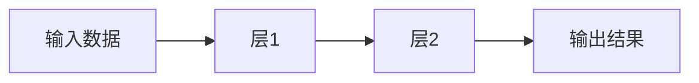

### **用最直白的方式讲懂 TensorFlow**
---

#### **1. 一句话解释**
**TensorFlow 是一个“机器学习工具箱”**，就像：
- 🤖 **乐高积木**：给你各种零件（函数），自己组装AI模型
- 🧑🍳 **炒菜锅**：给你工具（算法），自己“炒”出智能程序

---

#### **2. 核心概念拆解**
##### **（1）Tensor（张量）**
👉 **本质就是“带维度的数字”**
- 标量（0维）：`5`
- 向量（1维）：`[1,2,3]` （像Excel的一行）
- 矩阵（2维）：`[[1,2],[3,4]]` （像Excel表格）
- 更高维：比如彩色图片就是 `[高度, 宽度, 颜色通道]` 的张量

##### **（2）Flow（流）**
👉 **数据像水流一样流过计算过程**

（比如：图片输入 → 识别边缘 → 识别眼睛 → 输出“这是猫”）

---

#### **3. 举个现实例子**
**用 TensorFlow 教AI认水果**：
1. **准备数据**：
   - 苹果图片标“0”，香蕉图片标“1”
2. **搭模型**（像拼积木）：
   ```python
   model = tf.keras.Sequential([
     tf.keras.layers.Flatten(input_shape=(28, 28)),  # 把图片压平
     tf.keras.layers.Dense(128, activation='relu'),  # 加个“智能层”
     tf.keras.layers.Dense(2)  # 输出0或1
   ])
   ```
3. **训练**：
   ```python
   model.fit(图片数据, 标签, epochs=10)  # 让AI看10遍图片
   ```
4. **预测**：
   ```python
   model.predict(新图片)  # 问AI：这是苹果还是香蕉？
   ```

---

#### **4. 为什么用 TensorFlow？**
| **场景**              | **TensorFlow 能干嘛**              | **相当于**                  |
|-----------------------|-----------------------------------|----------------------------|
| 手机拍照识物          | 把小模型塞进手机（TF Lite）        | 给手机装“迷你AI大脑”        |
| 网站推荐系统          | 用JS在浏览器跑模型（TF.js）        | 让网页“偷偷”变聪明          |
| 工厂质检              | 训练模型识别缺陷产品               | 教AI当“质检员”             |

---

#### **5. 和普通人有什么关系？**
你每天都在用 TensorFlow 的“后代”：
- 📸 **谷歌相册**自动分类照片
- 🎵 **网易云音乐**推荐歌单
- 🗣️ **手机语音助手**听懂你说话

---

#### **6. 学习就像打游戏**
1. **新手村**：先玩 `tf.keras`（简单模式）
   ```python
   # 三行代码体验
   model = tf.keras.Sequential([tf.keras.layers.Dense(1)])
   model.compile(optimizer='adam', loss='mse')
   model.fit(x=[1,2,3], y=[2,4,6])  # 学 y=2x 的规律
   ```
2. **进阶副本**：调参、自定义模型
3. **终极大Boss**：部署到真实产品

---

#### **7. 常见困惑解答**
❓ **Q：一定要懂数学吗？**
👉 基础用法不需要！就像用美图秀秀不用懂Photoshop算法

❓ **Q：和Python什么关系？**
👉 TensorFlow 是Python的一个“外挂包”，安装命令：
```bash
pip install tensorflow
```

---

### **终极总结**
TensorFlow =
🔧 **工具**（组装AI模型） +
📦 **仓库**（现成算法直接拿） +
🚀 **发射台**（把模型送到手机/网站/工厂）

> 就像小时候玩四驱车：
> **TensorFlow 是给你的“工具箱”**，
> **数据是电池和零件**，
> **训练就是组装试跑**，
> **最终你的“AI赛车”就能自己跑了！**

