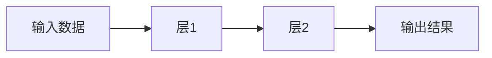

### **用最直白的方式讲懂 TensorFlow**
---

#### **1. 一句话解释**
**TensorFlow 是一个"机器学习工具箱"**，就像：
- 🤖 **乐高积木**：给你各种零件（函数），自己组装AI模型
- 🧑🍳 **炒菜锅**：给你工具（算法），自己"炒"出智能程序

---

#### **2. 核心概念拆解**
##### **（1）Tensor（张量）**
👉 **本质就是"带维度的数字"**
- 标量（0维）：`5`
- 向量（1维）：`[1,2,3]` （像Excel的一行）
- 矩阵（2维）：`[[1,2],[3,4]]` （像Excel表格）
- 更高维：比如彩色图片就是 `[高度, 宽度, 颜色通道]` 的张量

##### **（2）Flow（流）**
👉 **数据像水流一样流过计算过程**

（比如：图片输入 → 识别边缘 → 识别眼睛 → 输出"这是猫"）

---

#### **3. 举个现实例子**
**用 TensorFlow 教AI认水果**：
1. **准备数据**：
   - 苹果图片标"0"，香蕉图片标"1"
2. **搭模型**（像拼积木）：
   ```python
   model = tf.keras.Sequential([
     tf.keras.layers.Flatten(input_shape=(28, 28)),  # 把图片压平
     tf.keras.layers.Dense(128, activation='relu'),  # 加个"智能层"
     tf.keras.layers.Dense(2)  # 输出0或1
   ])
   ```
3. **训练**：
   ```python
   model.fit(图片数据, 标签, epochs=10)  # 让AI看10遍图片
   ```
4. **预测**：
   ```python
   model.predict(新图片)  # 问AI：这是苹果还是香蕉？
   ```

---

#### **4. 为什么用 TensorFlow？**
| **场景**              | **TensorFlow 能干嘛**              | **相当于**                  |
|-----------------------|-----------------------------------|----------------------------|
| 手机拍照识物          | 把小模型塞进手机（TF Lite）        | 给手机装"迷你AI大脑"        |
| 网站推荐系统          | 用JS在浏览器跑模型（TF.js）        | 让网页"偷偷"变聪明          |
| 工厂质检              | 训练模型识别缺陷产品               | 教AI当"质检员"             |

---

#### **5. 和普通人有什么关系？**
你每天都在用 TensorFlow 的"后代"：
- 📸 **谷歌相册**自动分类照片
- 🎵 **网易云音乐**推荐歌单
- 🗣️ **手机语音助手**听懂你说话

---

#### **6. 学习就像打游戏**
1. **新手村**：先玩 `tf.keras`（简单模式）
   ```python
   # 三行代码体验
   model = tf.keras.Sequential([tf.keras.layers.Dense(1)])
   model.compile(optimizer='adam', loss='mse')
   model.fit(x=[1,2,3], y=[2,4,6])  # 学 y=2x 的规律
   ```
2. **进阶副本**：调参、自定义模型
3. **终极大Boss**：部署到真实产品

---

#### **7. 常见困惑解答**
❓ **Q：一定要懂数学吗？**
👉 基础用法不需要！就像用美图秀秀不用懂Photoshop算法

❓ **Q：和Python什么关系？**
👉 TensorFlow 是Python的一个"外挂包"，安装命令：
```bash
pip install tensorflow
```

---

### **终极总结**
TensorFlow =
🔧 **工具**（组装AI模型） +
📦 **仓库**（现成算法直接拿） +
🚀 **发射台**（把模型送到手机/网站/工厂）

> 就像小时候玩四驱车：
> **TensorFlow 是给你的"工具箱"**，
> **数据是电池和零件**，
> **训练就是组装试跑**，
> **最终你的"AI赛车"就能自己跑了！**
>

### **用最直白的方式讲懂 PyTorch**
---

#### **1. 一句话解释**
**PyTorch 是另一个"AI积木箱"**，和 TensorFlow 类似，但更灵活、好上手，特别受学术圈和研究者欢迎。

---

#### **2. PyTorch 的核心概念**
##### **（1）Tensor（张量）**
👉 和 TensorFlow 一样，PyTorch 的"Tensor"就是多维数组，是 AI 计算的基本单位。

##### **（2）动态图（Dynamic Graph）**
👉 **像写普通 Python 代码一样写AI模型，边写边跑，调试超方便！**
- TensorFlow 1.x 时代是"先搭图再跑"，PyTorch 是"写一行跑一行"，更直观。

---

#### **3. PyTorch 现实例子**
**用 PyTorch 教AI认水果**：
```python
import torch
import torch.nn as nn
import torch.optim as optim

# 定义模型
model = nn.Sequential(
    nn.Flatten(),
    nn.Linear(28*28, 128),
    nn.ReLU(),
    nn.Linear(128, 2)
)

# 损失函数和优化器
loss_fn = nn.CrossEntropyLoss()
optimizer = optim.Adam(model.parameters())

# 训练（伪代码）
for epoch in range(10):
    for images, labels in dataloader:
        preds = model(images)
        loss = loss_fn(preds, labels)
        optimizer.zero_grad()
        loss.backward()
        optimizer.step()
```
（和 TensorFlow 很像，但写法更"原生Python"）

---

#### **4. PyTorch 的优势**
| **场景**         | **PyTorch 能干嘛**           | **相当于**                |
|------------------|-----------------------------|---------------------------|
| 学术研究         | 灵活搭建各种新奇AI模型       | "乐高自由拼"              |
| 快速原型         | 代码调试方便，实验效率高     | "边搭边试"                |
| 工业部署         | 现在也支持生产环境部署       | "从实验室到工厂"          |

---

#### **5. PyTorch 和 TensorFlow 对比**
| 特性/维度         | PyTorch                        | TensorFlow                      |
|------------------|-------------------------------|---------------------------------|
| 编程风格         | 更像原生Python，易调试        | 早期静态图，2.x后支持动态图     |
| 学术界流行度     | 非常高，论文和新模型首选      | 也有用，但略逊一筹             |
| 工业界流行度     | 近年增长快，部署能力提升      | 生态成熟，部署工具丰富         |
| 生态系统         | 开源项目多，社区活跃          | 工具链全，支持多平台           |
| 适合人群         | 研究者、开发者、学生          | 工程师、企业、开发者           |
| 代表应用         | ChatGPT、Stable Diffusion等    | Google Photos、TensorFlow Lite |

---

#### **6. 生活中的 PyTorch**
- **ChatGPT**、**Stable Diffusion** 等大模型训练都用过 PyTorch
- 很多最新的 AI 论文和开源项目首选 PyTorch

---

#### **7. 安装方法**
```bash
pip install torch
```

---

### **终极总结**
PyTorch =
🧩 **灵活积木**（自由搭建AI模型） +
🛠️ **调试神器**（像写Python一样写AI） +
🚀 **科研利器**（新模型实验首选）

> PyTorch 就像"DIY积木桌"，
> 你可以随心所欲拼出各种AI"新玩具"，
> 既能玩得开心，也能做出大作品！**


