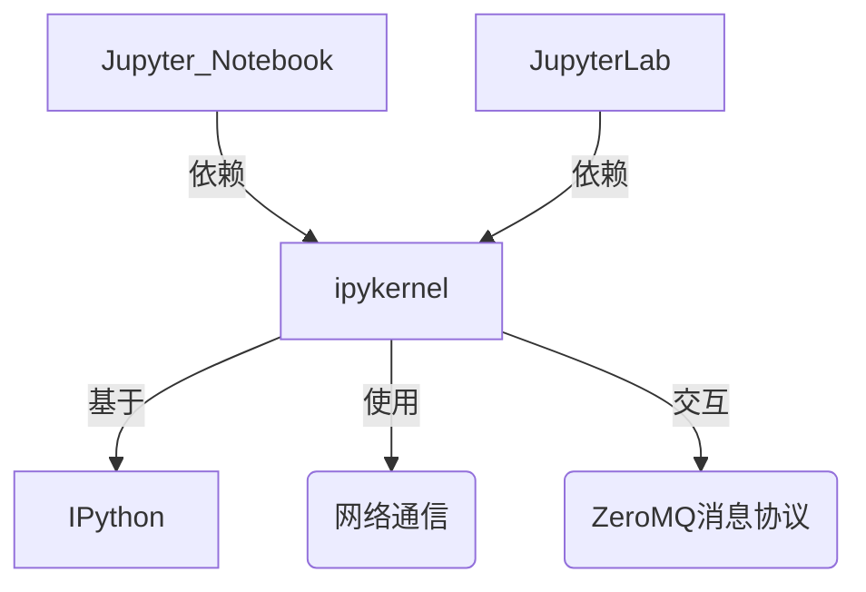

---
layout: post
title: 什么是Jupyter Notebook？
cover-img: /assets/img/0028963732_0.jpg
thumbnail-img: /assets/img/0028963732_0.jpg
share-img: /assets/img/0028963732_0.jpg
tags: [AI]
author: pocaster
published: false
---

Jupyter Notebook 是一个开源的交互式 Web 应用程序，允许用户创建和共享包含实时代码、可视化图表、数学公式、文本说明等内容的文档。它最初是 IPython 项目的一部分，后来发展为支持多种编程语言（如 Python、R、Julia 等），因此得名 "Jupyter"（Julia + Python + R 的组合）。

### 主要特点：
1. **交互式编程**：可以逐行或分块运行代码，立即查看结果。
2. **多语言支持**：通过内核（Kernel）支持 40+ 种编程语言。
3. **富文本编辑**：结合 Markdown 和 LaTeX 编写文档说明。
4. **数据可视化**：直接嵌入图表、图片、视频等多媒体内容。
5. **分享便捷**：可导出为 HTML、PDF、Markdown 等格式，或通过 JupyterHub 协作。

### 核心组件：
- **Notebook 界面**：基于浏览器的交互式环境。
- **Kernel**：独立进程，负责执行代码并返回结果。
- **文件格式**：`.ipynb` 文件（JSON 结构，包含代码、输出和元数据）。

### 典型应用场景：
- 数据清洗/分析
- 机器学习原型开发
- 教学演示
- 学术研究（可复现性文档）

### 示例代码单元（Python）：
```python
# 计算斐波那契数列
def fib(n):
    a, b = 0, 1
    for _ in range(n):
        print(a, end=' ')
        a, b = b, a+b
fib(10)
```
输出：`0 1 1 2 3 5 8 13 21 34`

### 扩展生态：
- JupyterLab：新一代模块化 IDE 界面
- JupyterHub：多用户服务器
- Voilà：将 Notebook 转换为独立 Web 应用

`ipykernel` 是 Jupyter 生态中的核心组件之一，它是 **IPython 内核的标准化实现**，专门为 Jupyter Notebook/JupyterLab 提供 Python 语言的代码执行支持。以下是详细解析：

---

### 1. **核心作用**
- **桥梁功能**：充当 Jupyter 前端（网页界面）与 Python 解释器之间的通信桥梁
- **协议实现**：遵循 Jupyter 的 `Kernel Protocol`，处理代码执行、补全、调试等请求
- **依赖基础**：所有基于 Jupyter 的 Python 交互环境（如 Notebook/Lab）都依赖它运行

---

### 2. **主要功能**
| 功能                | 说明                                                                 |
|---------------------|----------------------------------------------------------------------|
| 代码执行            | 解析并执行 Python 代码（支持异步/多线程）                           |
| 富文本输出          | 渲染 matplotlib 图表、Pandas 表格等富媒体结果                       |
| 调试支持            | 通过 `ipdb` 集成实现交互式调试                                       |
| 魔术命令            | 支持 `%timeit`、`%%html` 等 IPython 特有魔法命令                    |
| 内核管理            | 允许通过 `kernel.json` 配置 Python 环境路径                          |

---

### 3. **典型应用场景**
- **多版本 Python 管理**
  例如同时为 Python 3.8 和 3.11 创建独立内核：
  ```bash
  # 为特定环境安装内核
  python3.8 -m pip install ipykernel
  python3.8 -m ipykernel install --name py38

  python3.11 -m pip install ipykernel
  python3.11 -m ipykernel install --name py311
  ```
  在 Notebook 中可通过 `Kernel > Change kernel` 切换

- **自定义内核行为**
  通过继承 `IPythonKernel` 类实现：
  ```python
  from ipykernel.kernelapp import IPKernelApp
  class MyKernel(IPythonKernel):
      implementation = 'MyPython'
      banner = "Custom Kernel"
  IPKernelApp.launch_instance(kernel_class=MyKernel)
  ```

---

### 4. **与相关包的关系**


---

### 5. **常见问题处理**
- **问题**：`Kernel died` 错误
  **解决方案**：
  ```bash
  # 检查内核日志
  jupyter kernelspec list
  # 重新安装内核
  python -m ipykernel install --user --force-reinstall
  ```

- **问题**：虚拟环境内核不可见
  **解决步骤**：
  1. 激活虚拟环境
  2. 执行 `python -m ipykernel install --name venv_name`

---
