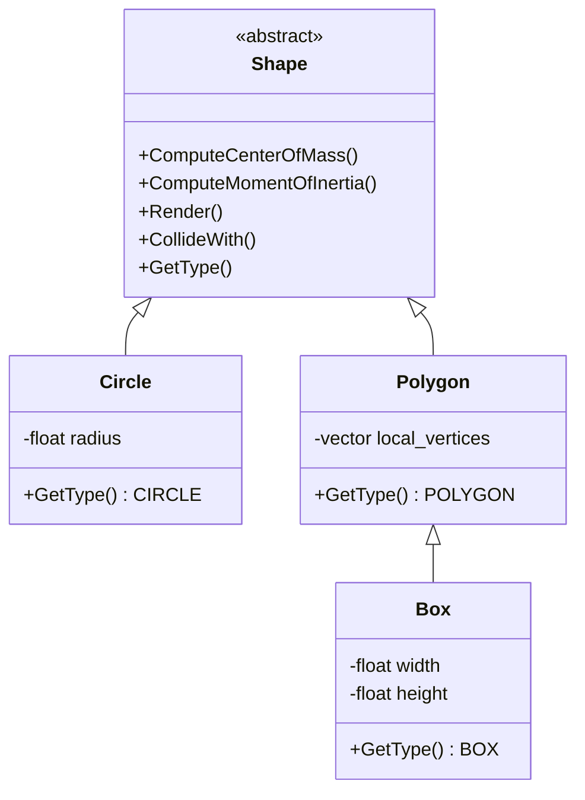

## **刚体形状系统设计与实现**

---

### **I. 形状类架构设计**

#### **1. 基类Shape：统一接口定义**
```cpp
class Shape {
public:
    virtual ~Shape() = default;
  
    // 计算几何属性
    virtual Vec2 ComputeCenterOfMass() const = 0;
    virtual float ComputeMomentOfInertia(float mass) const = 0;
  
    // 图形支持
    virtual void Render(const Transform& transform) const = 0;
  
    // 碰撞检测接口
    virtual bool CollideWith(const Shape* other, 
                            const Transform& this_tf,
                            const Transform& other_tf,
                            CollisionInfo& info) const = 0;

    // 形状类型标识
    enum Type { CIRCLE, POLYGON, BOX };
    virtual Type GetType() const = 0;
};
```

#### **2. 继承体系**


---

### **II. 圆形（Circle）类实现**

#### **1. 数据结构与构造函数**
```cpp
class Circle : public Shape {
public:
    explicit Circle(float r) : radius(r) {}

    Type GetType() const override { return CIRCLE; }
    float GetRadius() const { return radius; }

    // 几何属性计算
    Vec2 ComputeCenterOfMass() const override {
        return Vec2::Zero(); // 圆形质心始终在原点
    }

    float ComputeMomentOfInertia(float mass) const override {
        return 0.5f * mass * radius * radius; // I = ½mr²
    }

private:
    float radius;
};
```

#### **2. 图形渲染实现**
```cpp
void Circle::Render(const Transform& tf) const {
    const Vec2 world_center = tf.position;
    DrawCircle(world_center, radius * tf.scale, tf.rotation_angle); 
}
```

---

### **III. 多边形（Polygon）基类实现**

#### **1. 核心数据结构**
```cpp
class Polygon : public Shape {
public:
    // 从顶点列表构造（自动计算包围盒）
    explicit Polygon(const vector<Vec2>& vertices) {
        local_vertices = vertices;
        ComputeConvexHull(); // 确保顶点按序排列
        CalculateAABB(); 
    }

    Type GetType() const override { return POLYGON; }

    // 访问顶点（局部坐标系）
    size_t GetVertexCount() const { return local_vertices.size(); }
    Vec2 GetVertex(int index) const { return local_vertices[index]; }

protected:
    vector<Vec2> local_vertices;
    AABB local_aabb; // 轴对齐包围盒（缓存优化）

private:
    void ComputeConvexHull(); // 凸包计算（具体实现参见Andrew算法）
    void CalculateAABB();     // 计算局部坐标包围盒
};
```

#### **2. 质心与转动惯量计算**
```cpp
// 质心计算（按均匀密度假设）
Vec2 Polygon::ComputeCenterOfMass() const {
    float area_total = 0.0f;
    Vec2 center(0,0);
  
    // 通过三角分片累加质心
    const Vec2 p0 = local_vertices[0];
    for (int i=1; i<local_vertices.size()-1; ++i) {
        Vec2 p1 = local_vertices[i];
        Vec2 p2 = local_vertices[i+1];
      
        float area = 0.5f * Cross(p1-p0, p2-p0);
        center += (p0 + p1 + p2)/3.0f * area;
        area_total += area;
    }
  
    return center / area_total; 
}

// 转动惯量计算（绕质心）
float Polygon::ComputeMomentOfInertia(float mass) const {
    Vec2 com = ComputeCenterOfMass();
    float inertia = 0.0f;
  
    // 离散积分法（适用于任意凸多边形）
    for (int i=0; i<local_vertices.size(); ++i) {
        Vec2 p1 = local_vertices[i] - com;
        Vec2 p2 = local_vertices[(i+1)%local_vertices.size()] - com;
      
        float cross_term = Cross(p1, p2);
        inertia += cross_term * (Dot(p1,p1) + Dot(p1,p2) + Dot(p2,p2));
    }
  
    return (mass / (6.0f * Area())) * inertia; 
}
```

---

### **IV. 盒子（Box）类实现**

#### **1. 继承与构造优化**
```cpp
class Box : public Polygon {
public:
    Box(float w, float h) 
        : Polygon(GenerateVertices(w, h)), width(w), height(h) {}

    Type GetType() const override { return BOX; }

    // 便捷访问属性
    float GetWidth() const { return width * 2.0f; }  // 全宽
    float GetHeight() const { return height * 2.0f; } 

private:
    static vector<Vec2> GenerateVertices(float half_w, float half_h) {
        // 生成局部坐标系顶点（中心在原点）
        return {
            Vec2(-half_w, -half_h),
            Vec2( half_w, -half_h),
            Vec2( half_w,  half_h),
            Vec2(-half_w,  half_h)
        };
    }

    float width;   // 半宽
    float height;  // 半高
};
```

#### **2. 盒子转动惯量优化**
由于盒子是矩形的特例，转动惯量公式可优化为：
```cpp
float Box::ComputeMomentOfInertia(float mass) override {
    return mass * (width*width + height*height) / 12.0f; // I = ¹⁄₁₂m(w²+h²)
}
```

---

### **V. 形状与刚体的关联**

#### **1. 扩展刚体数据结构**
```cpp
struct RigidBody {
    Transform transform;   // 包含位置+旋转
    Shape* shape;          // 持有的形状对象
  
    Vec2 velocity;         // 线速度
    float angular_vel;     // 角速度
    // ...其他成员同前
};
```

#### **2. 世界坐标顶点转换**
通过变换矩阵将局部顶点转为世界坐标：
```cpp
vector<Vec2> GetWorldVertices(const Polygon* poly, const Transform& tf) {
    vector<Vec2> world_verts;
    for (const auto& v : poly->local_vertices) {
        // 应用缩放、旋转、平移
        Vec2 rotated = v.Rotate(tf.rotation_angle);
        world_verts.push_back(tf.position + rotated * tf.scale);
    }
    return world_verts;
}
```

---

### **VI. 形状工厂模式示例**

#### **1. 统一创建接口**
```cpp
unique_ptr<Shape> ShapeFactory::Create(ShapeType type, const ParamBundle& params) {
    switch(type) {
        case CIRCLE:
            return make_unique<Circle>(params.GetFloat("radius"));
        case BOX:
            return make_unique<Box>(params.GetFloat("width"), 
                                   params.GetFloat("height"));
        case POLYGON:
            return make_unique<Polygon>(params.GetVec2Array("vertices"));
        default:
            throw std::invalid_argument("Unknown shape type");
    }
}
```

---

### **VII. 碰撞检测基础框架**

#### **1. 类型分发处理**
```cpp
bool Shape::CollideWith(const Shape* other, 
                       const Transform& this_tf,
                       const Transform& other_tf,
                       CollisionInfo& info) const {
    // 类型分发矩阵
    const Type this_type = GetType();
    const Type other_type = other->GetType();
  
    if (this_type == CIRCLE && other_type == CIRCLE) {
        return CircleVsCircle(this, other, this_tf, other_tf, info);
    }
    else if ((this_type == CIRCLE && other_type == POLYGON) || 
            (this_type == POLYGON && other_type == CIRCLE)) {
        return CircleVsPolygon(this, other, this_tf, other_tf, info);
    }
    else if (this_type == POLYGON && other_type == POLYGON) {
        return PolygonVsPolygon(this, other, this_tf, other_tf, info);
    }
    return false;
}
```

---

### **VIII. 形状属性验证测试**

#### **1. 单元测试示例**
```cpp
TEST(ShapeTest, BoxInertia) {
    Box box(1.0f, 2.0f); // 宽2m，高4m
    float expected = (4.0f*4.0f + 16.0f)/12.0f; // (w²+h²)/12
    EXPECT_NEAR(box.ComputeMomentOfInertia(1.0f), expected, 0.001f);
}

TEST(ShapeTest, CircleCOM) {
    Circle circ(3.0f);
    EXPECT_EQ(circ.ComputeCenterOfMass(), Vec2(0,0));
}
```

---

### **IX. 性能优化策略**

#### **1. 快速计算优化表**
---

| **操作**                | **优化手段**                      | **适用场景**             |
|-------------------------|-----------------------------------|--------------------------|
| 转动惯量计算           | 使用解析公式替代离散积分         | 标准形状（圆、矩形）     |
| 凸包生成               | 预计算+缓存                      | 静态多边形               |
| 顶点变换              | SIMD并行计算（如SSE指令集）     | 高频更新的动态物体       |
| 质心计算              | 在构造时缓存结果                | 不变形刚体               |

---

通过层次化设计形状系统，开发者可灵活扩展新形状类型，同时保持核心物理逻辑的统一性。下一步可重点实现分离轴定理（SAT）与GJK碰撞检测算法，完善多边形间的精确交互。