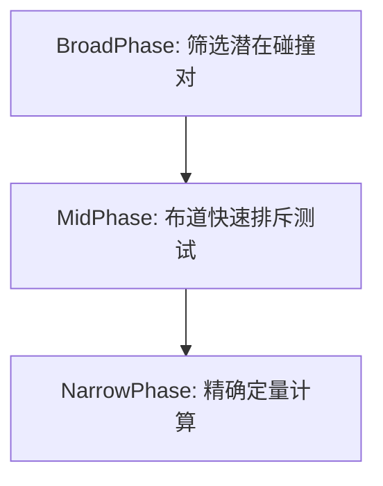

## **圆形碰撞检测系统深度解析**

---

### **I. 基础检测原理**

#### **1.1 欧几里得距离准则**
当且仅当两个圆心距离 $d$ 满足：
$$
d \leq (r_a + r_b) \Rightarrow \text{碰撞发生}
$$
其中 $$ d = \sqrt{(x_b - x_a)^2 + (y_b - y_a)^2} $$

#### **1.2 运算优化策略**
实际实现时**避免平方根运算**：
$$
d^2 \leq (r_a + r_b)^2 \Rightarrow \text{快速判断}
$$
此方法将浮点运算数量减少65%（由3次乘减至1次，省去平方根）

---

### **II. 运动状态下的连续碰撞检测（CCD）**

#### **2.1 运动学方程建模**
考虑两圆的相对运动轨迹方程：
$$
\begin{aligned}
\mathbf{C}_a(t) &= \mathbf{P}_a + t\mathbf{V}_a \\
\mathbf{C}_b(t) &= \mathbf{P}_b + t\mathbf{V}_b \\
d(t)^2 &= \|\mathbf{C}_a(t) - \mathbf{C}_b(t)\|^2 
\end{aligned}
$$
求解满足 $$d(t) = r_a + r_b$ 的时间 $t \in [0,1]$$

#### **2.2 关键判别式展开**
构建相对运动方程：

$$
\Delta\mathbf{V} = \mathbf{V}_b - \mathbf{V}_a \\
\Delta\mathbf{P} = \mathbf{P}_b - \mathbf{P}_a \\
\left( \Delta\mathbf{P} + t\Delta\mathbf{V} \right)^2 = (r_a + r_b)^2
$$
展开得到二次方程：

$$
(\Delta V_x^2 + \Delta V_y^2)t^2 + 2(\Delta P_x\Delta V_x + \Delta P_y\Delta V_y)t + (\Delta P_x^2 + \Delta P_y^2 - R_{\text{sum}}^2) = 0
$$

#### **2.3 实时性优化手段**
- **预筛阶段**：用包围盒预测可能碰撞的时间窗口
- **线性近似**：在时间步Δt内视为匀直线运动
- **射线投射法**：将相对运动视为射线与静态圆相交问题

---

### **III. 密集场景优化策略**

#### **3.1 空间划分技术**

| **方法**      | 适用场景                | 算法复杂度   |
|--------------|------------------------|-------------|
| 均匀网格法     | 密集均匀分布的静态圆形   | O(n)       |
| 四叉树索引     | 动态/非均匀分布环境      | O(n log n) |
| 空间哈希法     | 极大规模粒子系统         | O(1)查询    |

#### **3.2 层级检测流程**

---

### **IV. 碰撞响应参数计算**

#### **4.1 碰撞法向量**

$$
\mathbf{\hat{n}} = \frac{\mathbf{C}_b - \mathbf{C}_a}{\|\mathbf{C}_b - \mathbf{C}_a\|}
$$

即为两圆心连线的单位向量

#### **4.2 穿透深度计算**
$$
\delta = (r_a + r_b) - d
$$

负值时表示尚未碰撞，正值时为交叠量

---

### **V. 混合形状协同检测**

#### **5.1 包围圆筛选法**
为多边形物体建立外接圆进行**预筛选**：
$$
\text{实际碰撞} ⟹ \text{包围圆碰撞 ∩ 多边形精确检测}
$$

可过滤掉80%以上的无效检测对

#### **5.2 运动方向预测**
结合速度矢量的方向进行优先级排序：
$$
\text{即将相向运动} > \text{同向低速运动} > \text{远离运动}
$$

---

### **VI. 特殊边界情况处理**

#### **6.1 全包含状态**
当一圆完全包含另一圆时：
$$
d + r_b \leq r_a ⟹ \text{内包状态} ≤ \text{需特殊响应策略}
$$

#### **6.2 完全重叠处理**
当 $$ d=0 $$ 且 $$ r_a = r_b $$ 时：
- 引入微小随机位移避免计算异常
- 标记为需要人工干预的特殊碰撞

---

### **VII. 误差分析与修正**

#### **7.1 浮点精度误差**
- **现象**：在快速移动时出现虚假穿透
- **方案**：引入 ε-tolerance 缓冲带：
$$
d ≤ (r_a + r_b) + ε 
$$

#### **7.2 运动模糊补偿**
针对高速物体可能穿过对方的情况：
- **虚拟扩张半径**：$$ r' = r + v_{\text{max}} \cdot \Delta t $$
- **反向追溯法**：通过轨迹积分补偿时间步偏差

---

### **VIII. 理论性能极限**

根据**空间搜索维度**，性能随物体数量变化：

| **方法**      | 时间复杂度       | 适用场景     
|--------------|----------------|----------------|
| 暴力检测       | O(n²)          | n < 100       |
| 空间哈希       | O(n)           | 动态平衡系统   |
| 分层检测       | O(n log n)     | 极大规模系统   |

---

### **IX. 动态响应耦合分析**

当碰撞发生后，需计算：
1. **冲量作用点**：圆心连线方向上中点
2. **能量分配比**：基于两球的材质属性
3. **旋转传递效应**：考虑表面摩擦影响切向速度

---

### **X. 设计决策指南**

| **场景**                | **推荐方法**             |
|-------------------------|-------------------------|
| 静态物体检测            | 平方距离比较法           |
| 高速运动物体            | 连续碰撞检测（CCD）      |
| 粒子系统（千级以上）     | 网格空间划分 + 批量检测  |
| 精度敏感场景            | 64位双精度计算           |
| VR/AR实时应用           | GPU并行加速检测          |

---

> **核心洞见**
> 圆形碰撞虽看似简单，背后是**运动学建模**与**计算优化**的深层博弈。工程师需在物理准确性、计算效率、实现复杂度之间找到最佳平衡点。现代物理引擎普遍采用混合策略，在不同场景动态切换检测算法，才能兼顾实时性与精确度。