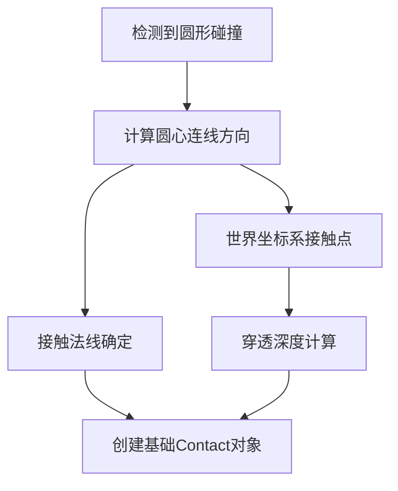
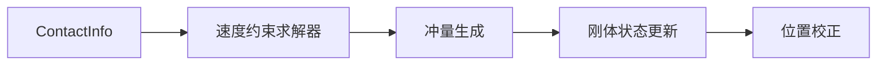

---
layout: post
title: 2D物理(17) Collosion Contact Infomation
cover-img: /assets/img/0028963732_0.jpg
thumbnail-img: /assets/img/0028963732_0.jpg
share-img: /assets/img/0028963732_0.jpg
tags: [Game Dev, AI]
author: pocaster
mathjax: true
---

## **Collision Contact Information 构建与处理**

---

### **I. 接触信息核心要素**

#### **1.1 最小数据单元**
每对碰撞物体产生至少一个接触点，应包含：
- **接触点世界坐标**：精确碰撞位置
- **碰撞法线方向**：垂直于接触面的分离方向
- **穿透深度**：物体间的重叠量
- **摩擦参数**：静摩擦与动摩擦系数
- **恢复系数**：碰撞的能量保留程度


---

### **II. 数据结构建模**

#### **2.1 基础接触结构体**
```cpp
struct Contact {
    Vec2 point;          // 世界空间接触点坐标
    Vec2 normal;         // 从A指向B的单位法线
    float penetration;   // 穿透深度（正值）
    float restitution;   // 弹性系数 [0,1]
    float static_friction; 
    float dynamic_friction;
  
    // 持久化标记（用于连续碰撞优化）
    uint8_t persist_count = 0;
};
```

#### **2.2 接触流形系统**
管理同一物体对的多点接触：
```cpp
class ContactManifold {
    std::array<Contact, 4> contacts; // 最大支持4点接触
    int contact_count = 0;
  
    // 持久化优化标记
    bool is_persistent = false; 
  
    void AddContact(const Contact& new_contact) {
        // 接触点去重与合并逻辑...
    }
};
```

---

### **III. 接触信息生成流程**

#### **3.1 圆形接触解析步骤**


#### **3.2 关键计算实现**
```cpp
Contact GenerateCircleContact(CircleCollider* a, CircleCollider* b) {
    Vec2 delta = b->position - a->position;
    float distance = delta.Length();
    float sum_radius = a->radius + b->radius;

    Contact contact;
    contact.normal = delta.Normalized(); // 法线方向A→B
    contact.penetration = sum_radius - distance;
    contact.point = a->position + contact.normal * (a->radius - contact.penetration*0.5f);
  
    // 从材质获取物性参数
    contact.restitution = std::min(a->material.restitution, b->material.restitution);
    contact.static_friction = sqrtf(a->material.static_friction * b->material.static_friction);
  
    return contact;
}
```

---

### **IV. 接触优化策略**

#### **4.1 Warm Start 机制**
```cpp
void ApplyPersistentContact(Contact& contact) {
    // 使用上一帧计算得到的冲量预热求解器
    Vec2 impulse = contact.cached_impulse;
    a->ApplyImpulse(-impulse, contact.point);
    b->ApplyImpulse(impulse, contact.point);
}
```

#### **4.2 接触点归并算法**
避免重复接触导致系统震荡：
```cpp
bool ShouldMergeContact(const Contact& c1, const Contact& c2) {
    return (c1.point.DistanceTo(c2.point) < MERGE_THRESHOLD) 
        && (c1.normal.Dot(c2.normal) > NORMAL_ANGLE_THRESHOLD);
}
```

---

### **V. 接触约束构建**

#### **5.1 速度约束方程**
基于冲量定理构建速度变化关系：
&&
\Delta v = J \cdot M^{-1} \cdot J^T \cdot \lambda
&&
其中：
- **J** 为雅可比矩阵，描述接触约束方向
- **λ** 为待求解的冲量系数
- **M** 为质量矩阵

#### **5.2 位置修正处理**
解决穿透问题的伪速度法：
```cpp
void PositionCorrection(Contact& contact) {
    float kSlop = 0.01f; // 允许的微小穿透
    float percent = 0.2f; // 校正百分比
  
    Vec2 correction = contact.normal * percent 
        * std::max(contact.penetration - kSlop, 0.0f) 
        / (a->inv_mass + b->inv_mass);
  
    a->position -= correction * a->inv_mass;
    b->position += correction * b->inv_mass;
}
```

---

### **VI. 碰撞响应子系统**

#### **6.1 冲量计算管道**


#### **6.2 摩擦模型实现**
库伦摩擦近似计算：
```cpp
Vec2 ComputeFrictionImpulse(const Contact& contact) {
    Vec2 relative_vel = b->GetVelocityAt(contact.point) 
                      - a->GetVelocityAt(contact.point);
    Vec2 tangent_vel = relative_vel - contact.normal * relative_vel.Dot(contact.normal);
  
    float max_friction = contact.normal_impulse * contact.static_friction;
    return tangent_vel.Truncate(max_friction);
}
```

---

### **VII. 高频问题应对方案**

#### **7.1 微小穿透震荡处理**
引入死区阈值：
```cpp
const float PENETRATION_EPSILON = 0.005f;
if (contact.penetration < PENETRATION_EPSILON) {
    return; // 忽略微小穿透
}
```

#### **7.2 碰撞抖动抑制**
通过历史帧数过滤：
```cpp
contact.normal = (prev_normal * 0.3f + new_normal * 0.7f).Normalized();
```

---

### **VIII. 高阶接触特性**

#### **8.1 连续接触预测**
```cpp
void PredictFutureContacts() {
    // 基于当前速度预测未来3帧的接触点
    Vec2 future_pos_a = a->position + a->velocity * 3*delta_time;
    Vec2 future_pos_b = b->position + b->velocity * 3*delta_time;
    // 进行预检测并缓存结果...
}
```

#### **8.2 可变接触硬度**
根据材质组合调整约束硬度：
```cpp
float ComputeEffectiveStiffness(Rigidbody a, Rigidbody b) {
    return 1.0f / (a.inv_mass + b.inv_mass 
         + (a.inv_inertia + b.inv_inertia) * contact.r_effective^2);
}
```

---

### **核心设计原则**
1. **物理正确性**：确保接触法线方向与冲量方向严格对应牛顿第三定律
2. **计算高效性**：利用接触持久化优化减少重复计算量
3. **数值稳定性**：引入缓冲阈值防止浮点误差累积
4. **系统扩展性**：支持多接触点与复杂物理效果叠加

> 在物理引擎开发中，接触信息处理需要平衡实时性与准确性。可以采用 **迭代求解 + 持久化接触 + 温暖启动** 的组合策略，可在30次迭代内稳定处理高达200个接触点的复杂场景。
