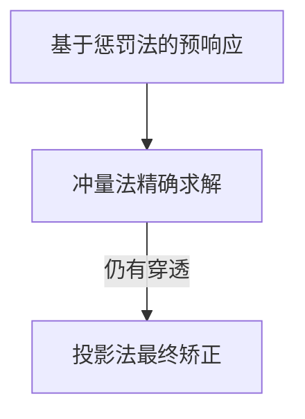

## **碰撞解决方案系统与方法论**

---

### **I. 位置投影修正法 (Projection Method)**

#### **1.1 核心原理**
通过**直接修改物体位置**消除渗透现象，具有即时修正特性：

 $$
\Delta \mathbf{p}_a = -\frac{m_b}{m_a + m_b} \cdot \delta \cdot \mathbf{\hat{n}} 
\Delta \mathbf{p}_b = +\frac{m_a}{m_a + m_b} \cdot \delta \cdot \mathbf{\hat{n}}
 $$

**适用场景**：
- 刚体 sleeping 状态时的静力学修正
- 处理微小穿透的补充矫正手段
- 低精度要求的快速迭代系统

#### **1.2 系统实现**
```cpp
void SolvePenetration(Rigidbody* a, Rigidbody* b, Contact& c) {
    const float k_slop = 0.01f;  // 允许的微小穿透
    const float k_bias = 0.2f;   // 校正强度系数
  
    // 计算质量权重因子
    float total_inv_mass = a->inv_mass + b->inv_mass;
    if (total_inv_mass == 0) return;
  
    // 有效穿透深度计算
    float penetration = std::max(c.penetration - k_slop, 0.0f);
    float lambda = k_bias * penetration / total_inv_mass;
  
    // 施加位置修正
    Vec2 correction = c.normal * lambda;
    a->position -= a->inv_mass * correction;
    b->position += b->inv_mass * correction;
}
```

**优点**：
- 实现极其简单，适合快速开发初期原型
- 无需考虑速度状态，静态修正效果立即可见
- 无迭代需求，运算成本恒定

**缺点**：
- **违反动量守恒定律**，可能导致人造能量注入
- 处理高速碰撞时会产生抖动现象
- 无法正确传递旋转效应

---

### **II. 冲量解析法 (Impulse Method)**

#### **2.1 基础理论推导**
基于牛顿恢复系数定律，构建动量守恒方程：

 $$
(1 + e) \mathbf{v}_{rel} \cdot \mathbf{\hat{n}} = \mathbf{v}'_{rel} \cdot \mathbf{\hat{n}}
 $$

分解法线冲量和切向摩擦力冲量：

**法线冲量计算**：
 $$
j_n = \frac{ -(1 + e) \mathbf{v}_{rel} \cdot \mathbf{\hat{n}} }{ \mathbf{\hat{n}} \cdot (\mathbf{\hat{n}} (\frac{1}{m_a} + \frac{1}{m_b}) ) + ... }
 $$

**切向冲量计算**（库伦摩擦模型）：
 $$
j_t = 
\begin{cases}
-\mu_s j_n \mathbf{\hat{t}}, & |\mathbf{v}_t| < \epsilon \text{（静摩擦）} \\
-\mu_d j_n \mathbf{\hat{t}}, & \text{其他（动摩擦）}
\end{cases}
 $$

#### **2.2 刚体冲量实施**
```cpp
void ApplyImpulse(Rigidbody* a, Rigidbody* b, Contact& c) {
    // 计算接触点相对速度
    Vec2 v_a = a->velocity + Cross(a->angular_velocity, c.point - a->center);
    Vec2 v_b = b->velocity + Cross(b->angular_velocity, c.point - b->center);
    Vec2 v_rel = v_b - v_a;
  
    // 法线冲量计算
    float v_n = Dot(v_rel, c.normal);
    float e = c.restitution; 
    float numerator = -(1 + e) * v_n;
  
    // 构建冲量分母项（含转动惯量）
    float r_ax = Cross(c.point - a->center, c.normal);
    float r_bx = Cross(c.point - b->center, c.normal);
    float denominator = a->inv_mass + b->inv_mass 
                      + a->inv_inertia * r_ax * r_ax
                      + b->inv_inertia * r_bx * r_bx;
  
    float j_n = numerator / max(denominator, 0.001f); // 防止除以零
  
    // 切向摩擦冲量计算
    Vec2 tangent = (v_rel - Dot(v_rel, c.normal)*c.normal).Normalize();
    float j_t = -Dot(v_rel, tangent) / denominator;
    j_t = clamp(j_t, -c.static_friction*j_n, c.static_friction*j_n);
  
    // 综合冲量应用
    Vec2 impulse = j_n * c.normal + j_t * tangent;
    a->ApplyImpulse(-impulse, c.point);
    b->ApplyImpulse(impulse, c.point);
}
```

**优点**：
- **真实物理行为**再现（动量守恒、角动量守恒）
- 自动处理摩擦力与旋转耦合
- 稳定可靠的专业物理引擎首选方案

**缺点**：
- 复杂公式推导，实现难度较高
- 需要多次迭代才能收敛（通常8-16次）
- 处理持续接触时需配合warm start技术

---

### **III. 弹性势能惩罚法 (Penalty Method)**

#### **3.1 原理说明**
将碰撞视为时变弹簧系统，通过胡克定律产生恢复力：

 $$
\mathbf{F}_p = -k_p \delta \mathbf{\hat{n}} - k_d (\mathbf{v}_{rel} \cdot \mathbf{\hat{n}})\mathbf{\hat{n}}
 $$

- **k_p**: 刚度系数（spring stiffness）
- **k_d**: 阻尼系数（damping coefficient）
- **δ**: 当前穿透深度

#### **3.2 动态力计算模型**
```cpp
Vec2 ComputePenaltyForce(Contact& c, float dt) {
    // 弹性力项
    float kp = 1000.0f; // 根据材质调整
    float elastic_force = kp * c.penetration;
  
    // 阻尼力项
    float kd = 10.0f; 
    float damping_force = kd * Dot(relative_velocity, c.normal);
  
    // 二力合成
    return -(elastic_force + damping_force) * c.normal;
}
```

**优点**：
- 并行计算友好，适合GPU加速
- 处理超大规模粒子碰撞效率高
- 可实现穿透的平滑过渡修正

**缺点**：
- 需要微小时间步长（＜1/100s）防止爆炸性增长
- 高刚度系数导致数值不稳定性
- 缺乏真实的物理理论基础支持

---

### **IV. 方法性能对比**

| **指标**           | 投影法         | 冲量法          | 惩罚法         |
|--------------------|---------------|----------------|---------------|
| 物理准确性         | ★☆☆☆☆        | ★★★★★         | ★★☆☆☆        |
| 计算成本           | ★★☆☆☆        | ★★★★☆          | ★★★☆☆        |
| 实现复杂度         | ★☆☆☆☆        | ★★★★★         | ★★☆☆☆        |
| 数值稳定性         | ★★☆☆☆        | ★★★★☆          | ★☆☆☆☆        |
| 连续接触处理       | △             | ◎              | ×             |

---

### **V. 混合系统架构设计**

**整合三种方法的阶梯式框架**：



#### **5.1 主循环伪代码**
```python
def PhysicsStep(dt):
    # 阶段1: 广义冲量求解
    for 8 iterations:
        solveImpulseMethod()
  
    # 阶段2: 深度穿透惩罚
    if penetration > threshold:
        updatePenaltyForces()
  
    # 阶段3: 异常位置修正
    applyProjectionCorrection()
```

#### **5.2 参数协调原则**
- **刚度系数自适应**：根据穿透速度自动调整
 $$
k_p = \frac{m}{\Delta t^2}, \quad m为物体质量 
 $$
- **温启动机制**：继承上一帧的冲量值作为初始估计
- **操作顺序原则**：速度→位置修正层级递进

---

### **VI. 高级优化技巧**

#### **6.1 多重子步长技术**
对高速运动物体实施：
 $$
\begin{cases}
\Delta t_{sub} = \frac{\Delta t}{n} \\
n = \text{ceil}(\|\mathbf{v}\| \cdot \delta t / \text{网格尺寸}) 
\end{cases}
 $$

#### **6.2 接触维持策略**
针对堆叠物体优化：
- **接触持久化**：缓存历史接触点
- **接触流形合并**：减少冗余计算
- **休眠过滤**：静止后停止物理模拟

---

### **VII. 实践建议与陷阱规避**

1. **轧制现象预防**
   为移动平台物体添加特殊标志位：

   ```cpp
   if (body.isKinematic && velocity.length() > threshold) {
       useContinuousCollisionDetection(); 
   }
   ```

2. **自由旋转仿真**
   使用角速度 clamping：
  $$
   \omega_{max} = \sqrt{\frac{2E_{rotation}}{I}}
  $$

3. **数值积分选择**
   采用半隐式欧拉法保稳定：
  $$
   \mathbf{v}^{n+1} = \mathbf{v}^n + \mathbf{F}_{ext}/m \cdot \Delta t
   \mathbf{x}^{n+1} = \mathbf{x}^n + \mathbf{v}^{n+1} \cdot \Delta t
   $$

---

> **黄金法则**：在游戏开发中推荐采用 **[冲量法 + 适量投影修正]** 的混合方案，既保证物理合理性又处理深层穿透问题。对于需要实时交互的 VR 操作物体可额外叠加惩罚力增强触觉反馈。

