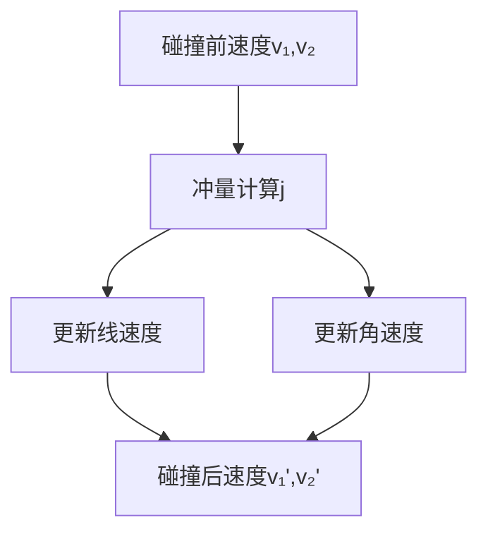

---
layout: post
title: 2D物理(22) Velocity At Point
thumbnail-img: /assets/img/0028963732_0.jpg
share-img: /assets/img/0028963732_0.jpg
tags: [Game Dev, AI]
author: pocaster
mathjax: true
---

## **刚体点速度与碰撞后速度计算解析**

---

### **I. 接触点合成速度 (Velocity at Point)**

#### **1.1 速度合成公式**

$$
\mathbf{v}_P = \underbrace{\mathbf{v}_{\text{linear}}}_{\text{线速度}} + \underbrace{\mathbf{\omega} \times \mathbf{r}_P}_{\text{角速度贡献}}
$$
**符号说明**：
- \(\mathbf{v}_{\text{linear}}\): 物体质心线速度
- \(\mathbf{\omega}\): 角速度矢量（3D）/标量（2D）
- \(\mathbf{r}_P\): 质心到点P的向量


#### **1.2 三维到二维简化**

**三维投影到二维平面**：
$$
\mathbf{\omega} \times \mathbf{r}_P \Rightarrow \omega \cdot \mathbf{r}_P^{\perp} \quad (\text{其中} \ \mathbf{r}_P^{\perp} = [-r_y, r_x])
$$

**代码实现**：
```cpp
Vec2 ComputePointVelocity(const RigidBody& body, const Vec2& point) {
    Vec2 r = point - body.position;     // 相对质心位置
    Vec2 tangent(-r.y, r.x);            // 旋转方向切线
    return body.linearVelocity + body.angularVelocity * tangent;
}
```

---

### **II. 碰撞后速度更新 (Post-Collision Velocity)**

#### **2.1 冲量法更新原则**

**更新方程**：
$$
\begin{cases}
\mathbf{v}_{\text{new}} = \mathbf{v} + \frac{\mathbf{j}}{m} \\
\mathbf{\omega}_{\text{new}} = \mathbf{\omega} + \mathbf{I}^{-1} (\mathbf{r} \times \mathbf{j})
\end{cases}
$$
**冲量约束**：
- 冲量方向由法线决定 \(\mathbf{j} = j_n\mathbf{n} + j_t\mathbf{t}\)
- 需满足库仑摩擦条件 \( |j_t| \leq \mu j_n \)

#### **2.2 碰撞响应流程图**



---

### **III. 完整碰撞响应计算**

#### **3.1 关键参数计算步骤**

1. **相对速度计算**：
$$
   \mathbf{v}_{\text{rel}} = (\mathbf{v}_B + \mathbf{\omega}_B \times \mathbf{r}_B) - (\mathbf{v}_A + \mathbf{\omega}_A \times \mathbf{r}_A)
$$

2. **法向冲量计算**：
$$
   j_n = \frac{ -(1+e)(\mathbf{v}_{\text{rel}} \cdot \mathbf{n}) }{ \text{有效质量} }
   \]
   \[
   \text{有效质量} = \frac{1}{m_A} + \frac{1}{m_B} + \frac{ (\mathbf{r}_A \times \mathbf{n})^2 }{I_A} + \frac{ (\mathbf{r}_B \times \mathbf{n})^2 }{I_B}
$$

3. **摩擦冲量限制**：
$$
   j_t^{max} = \mu j_n \quad \Rightarrow \quad j_t = \text{clamp}(..., -j_t^{max}, j_t^{max})
$$

#### **3.2 完整C++示例**

```cpp
struct ContactSolver {
    struct Contact {
        Vec2 point;     // 碰撞点
        Vec2 normal;    // 法线方向
        float e;        // 恢复系数
        float mu;       // 摩擦系数
    };
  
    void Resolve(RigidBody& a, RigidBody& b, const Contact& c) {
        // 计算相对向量
        Vec2 rA = c.point - a.position;
        Vec2 rB = c.point - b.position;
      
        // 计算接触点速度
        Vec2 vA = a.linearVel + a.angularVel * Vec2(-rA.y, rA.x);
        Vec2 vB = b.linearVel + b.angularVel * Vec2(-rB.y, rB.x);
        Vec2 vRel = vB - vA;
      
        // 计算有效质量
        float normalMass = 1.0f/(a.invMass + b.invMass + 
                        CrossSqr(rA, c.normal)*a.invInertia + 
                        CrossSqr(rB, c.normal)*b.invInertia);
      
        // --> 法线方向冲量
        float vNormal = Dot(vRel, c.normal);
        float jn = -(1 + c.e) * vNormal * normalMass;
        jn = std::max(jn, 0.0f); // 防止拉力
      
        // --> 切线方向冲量
        Vec2 tangent = Normalize(vRel - c.normal * vNormal);
        float tangentMass = 1.0f/(a.invMass + b.invMass + 
                        CrossSqr(rA, tangent)*a.invInertia + 
                        CrossSqr(rB, tangent)*b.invInertia);
        float vt = Dot(vRel, tangent);
        float jtMax = c.mu * jn;
        float jt = -vt * tangentMass;
        jt = Clamp(jt, -jtMax, jtMax);
      
        // 合成冲量向量
        Vec2 impulse = jn * c.normal + jt * tangent;
      
        // 应用冲量到两个物体
        ApplyImpulse(a, -impulse, rA);
        ApplyImpulse(b,  impulse, rB);
    }

    inline float CrossSqr(const Vec2& r, const Vec2& dir) {
        return (r.x*dir.y - r.y*dir.x); // 叉积在2D中的表达
    }
  
    void ApplyImpulse(RigidBody& rb, const Vec2& impulse, const Vec2& r) {
        rb.linearVel  += impulse * rb.invMass;
        rb.angularVel += Cross(r, impulse) * rb.invInertia;
    }
};
```

---

### **IV. 关键工程实践**

#### **4.1 特殊案例处理**

**情形：静态物体碰撞**
$$
// 当检测到静态物体时调整冲量计算
if(a.IsStatic()) {
    impulse =  impulse * 2.0f; // 动态物体承受双倍冲量
    b.ApplyImpulse(impulse);   // 静态物体速度不变
}
$$

**情形：完全非弹性碰撞**
$$
(e=0)\ \Rightarrow \ \text{冲击后法向速度完全消除}
\]
\[
v_n' = 0, \quad v_t' = \text{剩余切向速度}
$$

#### **4.2 数值稳定性保障技巧**

- **速度截止阈值**（避免微小震荡）
  ```cpp
  const float SLEEP_THRESHOLD = 0.01f;
  if(LengthSq(linearVel) < SLEEP_THRESHOLD && abs(angularVel) < SLEEP_THRESHOLD) {
      SetSleepState(true); 
  }
  ```

- **冲量限幅处理**：
  ```cpp
  const float MAX_IMPULSE = 1000.0f;
  jn = Clamp(jn, -MAX_IMPULSE, MAX_IMPULSE);
  ```

---

### **V. 碰撞响应验证方法**

#### **5.1 可视化调试工具**

**速度箭头绘制函数**：
```cpp
void DebugDrawVelocity(const RigidBody& rb) {
    DrawArrow(rb.position, rb.linearVel, RED);  // 线速度
    DrawCircularArrow(rb.angularVel, rb.position, BLUE); // 角速度
}
```

#### **5.2 单位测试用例**

**测试案例1：完全弹性碰撞**
```python
# 输入参数
m1, m2 = 1.0, 1.0
v1_initial = [2.0, 0], ω1 = 0.0
v2_initial = [-1.0,0], ω2 = 0.0
e = 1.0

# 预期结果
v1_final = [-1.0, 0], v2_final = [2.0, 0]
assert NearlyEqual(CalcFinalVelocity(), expected)
```

**测试案例2：纯旋转碰撞**
```python
# 输入：一个静止物体被旋转物体撞击
m1 = INF, m2 = 1.0
v1 = [0,0], ω1 = 5.0 rad/s
v2 = [0,0], ω2 = 0.0

# 结果验证：角动量是否守恒
angular_momentum_before = I1 * ω1
angular_momentum_after = I1 * ω1' + I2 * ω2'
assert Delta(angular_momentum) < EPSILON
```

---

> **重要结论**：在真实游戏引擎开发中，接触点速度的计算精度直接影响碰撞响应的真实感。建议采用 **双精度浮点数处理速度相关计算**，搭配 **预测校正算法** 处理高速运动物体的穿透问题。同时，对旋转能量过高的物体（如陀螺效应）要加入 **角速度阻尼机制** 避免数值失真。