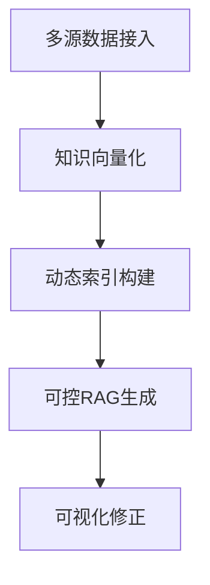
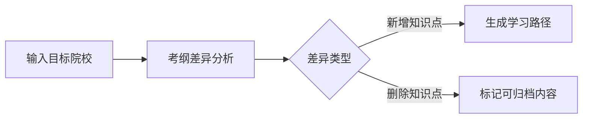

# **学习类AI服务 PRD**

**版本号**：1.2 
**最后更新**：2024-06-20 
**文档所有者**：PO 
---

## **一、概述**

### **1.1 产品概述及目标**

#### **1.1.1 背景介绍**
- 考研用户面临知识体系分散（纸质笔记/电子资料/课程视频）、AI工具决策不透明、跨校备考调整困难等痛点
- 现有AI学习产品普遍存在两大问题：
  1. **RAG（检索增强生成）黑箱化**：用户无法干预知识检索逻辑
  2. **静态知识库**：无法适应备考动态需求（如院校更换/考纲更新）

#### **1.1.2 产品概述**
- 基于私有化知识库的智能学习系统，包含：
  - **动态知识引擎**：支持多模态数据接入与自适应索引
  - **可视化RAG控制台**：允许调节检索宽度/时间衰减/知识权重
  - **智能迁移工具**：一键对比跨院校考纲差异并生成补缺方案

#### **1.1.3 产品目标**

✏️**业务目标**


| 阶段   | 目标                              | 衡量指标                     |
|--------|-----------------------------------|------------------------------|
| 近期   | 建立差异化竞争壁垒                | RAG可控参数数量≥15个         |
| 中期   | 形成用户知识资产沉淀              | 人均知识卡片数＞200张/月     |
| 远期   | 构建考研领域知识协作网络          | 机构API调用量＞50万次/日     |


✏️**用户目标**
- **精准定位**：识别知识漏洞所需时间缩短70%
- **灵活调整**：院校切换时的知识迁移效率提升3倍
- **决策透明**：100%可追溯AI生成的依据来源

#### **1.1.4 目标用户**


| 用户类型       | 核心场景                              | 使用频率       |
|----------------|---------------------------------------|----------------|
| 跨校考生       | 目标院校专业课程差异分析              | 高频（3-5次/周）|
| 在职备考者     | 碎片化知识整合与智能提醒              | 中频（1-2次/天）|
| 辅导机构教师   | 批量生成个性化学习方案                | 低频（2-3次/月）|

### **1.2 全局说明**

#### **1.2.1 全局异常处理**


| 异常类型         | 处理方案                              |
|------------------|---------------------------------------|
| 知识解析失败     | 自动触发人工复核通道（30分钟内响应）  |
| 检索超时（＞5s） | 降级返回本地缓存结果并标记数据新鲜度  |


#### **1.2.2 普通列表规则**
- **排序规则**：默认按知识关联度排序（可切换时间/权重排序）
- **分页逻辑**：智能动态加载（每页20条±5条自适应）
- **缺省值**：未标注知识点自动继承上级目录权重

#### **1.2.3 全局交互**
- **吐司提示**：操作反馈显示持续时间2s±0.5s
- **数据缺省页**：包含「快速导入」与「AI生成建议」双入口

### **1.3 名词说明**


| 术语       | 解释                                  |
|------------|---------------------------------------|
| 知识DNA    | 用户知识库的特征向量表示              |
| 检索宽度   | 控制关联知识拓展范围的参数（1-5级）   |


### **1.4 角色及权限**


| 角色       | 权限范围                              |
|------------|---------------------------------------|
| 普通用户   | 私有知识库管理与基础RAG调节           |
| 机构管理员 | 批量导入考纲数据与查看群体分析报告    |

### **1.5 文档阅读对象**
- 研发：技术方案实现参考
- UI：交互细节规范
- 运营：功能卖点提取

## **二、产品描述**

### **2.1 产品需求描述**
- 核心需求：解决考研场景下的**可控知识增强**问题（详见3.1章）

### **2.2 产品整体流程**

#### **2.2.1 主流程**


#### **2.2.2 子流程（以跨院校调整为例）**


### **2.3 产品版本规划**


| 版本   | 时间节点 | 核心功能                          |
|--------|----------|-----------------------------------|
| Alpha  | 2024 Q2  | 基础知识库+RAG控制台              |
| Beta   | 2024 Q3  | 院校迁移工具+协作审阅             |
| GA     | 2024 Q4  | 联邦学习支持+机构API开放          |

（因篇幅限制，后续章节框架示例）

### **3.1 智能知识库功能**
#### **3.1.3 前置条件**
- 用户至少上传3类资料（PDF/笔记/真题）
- 完成初始知识体系标定

#### **3.1.6 业务流程**
```python
def 知识更新流程():
    while 新数据输入:
        提取语义特征 --> 冲突检测 --> 版本快照 --> 向量化存储
```

## **四、非功能需求**

### **4.3 性能需求**
- 知识检索响应时间：90%请求＜2s（百万级向量库）
- 并发支持：≥5000用户同时使用RAG控制台

### **4.4 数据安全**
- 知识加密：采用国密SM4算法存储用户私有数据
- 审计追踪：所有生成内容保留完整决策日志

**附件**：
1. 《考研知识图谱标准v2.1》
2. RAG控制台高保真原型（Figma链接）
