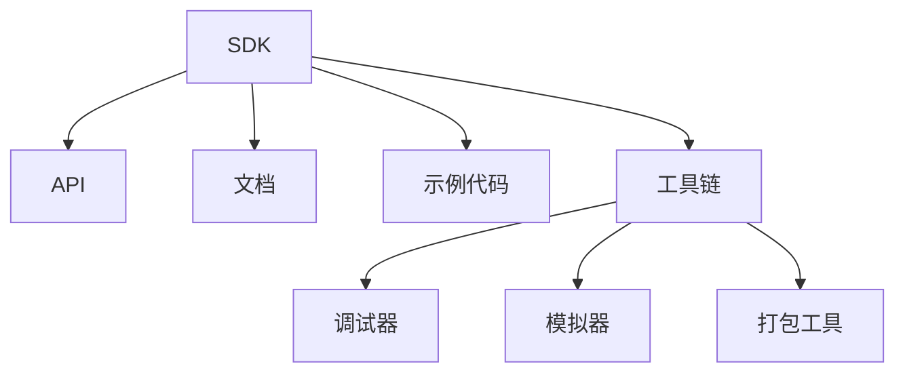
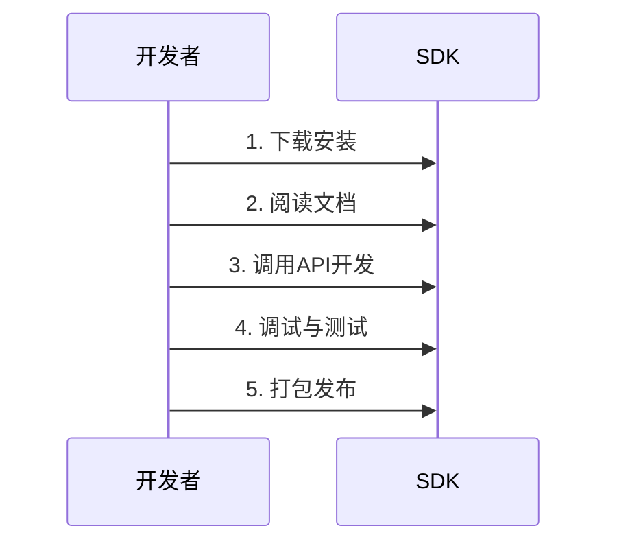
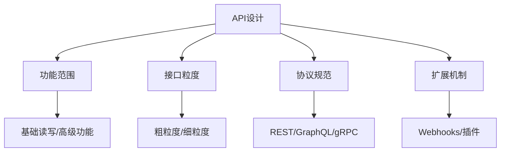

### **SDK（软件开发工具包）详解**

#### **1. 核心定义**
**SDK**（Software Development Kit，软件开发工具包）是一套**预先封装好的工具集合**，用于帮助开发者**快速构建特定平台、硬件或服务的应用程序**。它通常包含：
- **代码库/API**（核心功能接口）
- **开发文档**（使用说明、示例代码）
- **调试工具**（模拟器、日志分析）
- **编译环境**（编译器、打包工具）

#### **2. 核心组成**


#### **3. 典型应用场景**
| **场景**               | **示例SDK**                     | **作用**                          |
|------------------------|---------------------------------|-----------------------------------|
| 移动开发               | Android SDK, iOS SDK           | 调用摄像头、GPS等硬件功能          |
| 云服务                 | AWS SDK, 阿里云SDK             | 快速接入云存储、AI服务             |
| 支付系统               | 支付宝SDK, Stripe SDK          | 集成支付、身份验证功能              |
| 游戏引擎               | Unity SDK, Unreal Engine SDK   | 开发跨平台3D游戏                   |
| 硬件设备               | 大疆无人机SDK, Arduino SDK     | 控制无人机、传感器等硬件            |

#### **4. SDK vs API vs 框架**
| **维度**       | **SDK**                        | **API**                         | **框架**                       |
|----------------|--------------------------------|---------------------------------|--------------------------------|
| **范围**       | 工具**集合**（含API+工具链）    | 单一接口规范                     | 开发**架构**（如Spring）        |
| **灵活性**     | 中等（提供工具但需自行组装）     | 高（仅调用接口）                 | 低（需遵循框架规则）           |
| **典型代表**   | Windows SDK, Facebook SDK      | Twitter API, Google Maps API    | Django, React                 |

#### **5. 开发者使用SDK的典型流程**


#### **6. 选择SDK的关键考量**
- **兼容性**：是否支持目标平台（如iOS/Android）
- **功能覆盖**：是否包含所需全部接口
- **文档质量**：示例代码、错误处理说明是否完善
- **社区支持**：GitHub活跃度、Stack Overflow问答数量
- **授权条款**：是否开源？商用是否需要付费？

#### **7. 实际案例**
- **抖音SDK**：
  开发者通过集成SDK，快速实现视频拍摄、特效添加、分享功能。
- **微信小程序SDK**：
  提供登录、支付、地理位置等API，降低开发门槛。

#### **8. 常见问题**
- **Q：SDK是否需要开源？**
  A：不一定，可能仅提供二进制文件（如闭源商业SDK）。
- **Q：SDK会绑定厂商吗？**
  A：部分SDK存在厂商锁定（Vendor Lock-in）风险，需谨慎选择。

---

### **总结**
SDK是**“开发者的工具箱”**，通过封装复杂底层逻辑，显著提升开发效率。选择时需权衡功能、易用性和长期维护性。


### **API的作用与提供方设计的关系解析**

#### **1. 核心结论**
**API的作用确实高度依赖提供方的设计**，但开发者仍可通过合理选择和使用策略最大化其价值。提供方的设计决定了API的**能力边界**和**灵活性**，而开发者需要在此基础上进行适配和优化。

---

### **2. API能力的决定因素**
##### **（1）提供方设计的核心维度**


##### **（2）典型设计模式对比**
| **设计类型**       | **特点**                          | **案例**                      | **开发者灵活性** |
|--------------------|-----------------------------------|-------------------------------|----------------|
| **全功能型API**    | 提供完整业务逻辑封装（如支付闭环） | 支付宝API                     | 低（黑箱调用） |
| **原子化API**      | 仅提供基础操作（如CRUD）           | AWS S3文件上传API             | 高（需自行组合）|
| **可扩展API**      | 支持自定义钩子或插件               | Shopify App扩展API            | 中（需遵循规则）|

---

### **3. 提供方设计对开发者的影响**
##### **（1）正向案例：设计良好的API**
- **微信支付API**
  - 提供方设计：标准化接口+沙箱环境+详细状态码
  - 开发者收益：快速集成支付功能，错误易于排查

##### **（2）受限案例：设计缺陷的API**
- **某气象局数据API**
  - 提供方设计：仅返回XML格式，无分页机制
  - 开发者困境：需额外开发格式转换和缓存模块

---

### **4. 开发者的应对策略**
即使API设计受限，仍可通过以下方法优化：

##### **（1）适配层模式**
```python
# 示例：对设计粗糙的API封装适配层
class PoorAPIAdapter:
    def __init__(self, api_client):
        self.api = api_client

    def get_user_data(self, user_id):
        # 原始API返回混乱的JSON
        raw_data = self.api.get(f"/users?id={user_id}")
        # 统一处理为规范结构
        return {
            "id": raw_data["userID"],
            "name": raw_data["userName"],
            "email": raw_data.get("contact", {}).get("email")
        }
```

##### **（2）扩展方案对比**
| **提供方能力**       | **开发者补充方案**                |
|----------------------|----------------------------------|
| 无Webhook支持         | 轮询查询+本地数据库缓存           |
| 缺乏SDK               | 自建API Client（如Retrofit封装）  |
| 文档不完整            | 逆向工程+社区共建文档（如GitHub Wiki）|

---

### **5. 设计优秀的API特征**
提供方若想最大化API价值，应具备：
1. **一致性**：遵循OpenAPI规范，接口命名/参数风格统一
2. **可观测性**：提供请求ID、速率限制头（X-RateLimit）
3. **渐进式演进**：版本控制（如`/v1/users`），废弃旧版本有缓冲期
4. **开发者体验**：
   - 交互式文档（Swagger UI）
   - Postman集合一键导入

---

### **6. 行业现状数据**
- **API设计质量影响采用率**：
  - 良好设计的API生态（如Stripe）开发者留存率达85%
  - 设计混乱的API平均集成时间增加3倍（来源：Postman 2023报告）

---

### **总结**
- **提供方责任**：设计决定API的能力天花板，需平衡易用性与灵活性
- **开发者智慧**：通过适配层、扩展工具和社区协作突破设计限制
- **终极目标**：**提供方与开发者协同**，让API从"能用"变为"好用"

> 正如Linux创始人Linus Torvalds所言：
> **"好的API设计如同氧气——当它存在时你感觉不到，当它缺失时你窒息难忍。"**