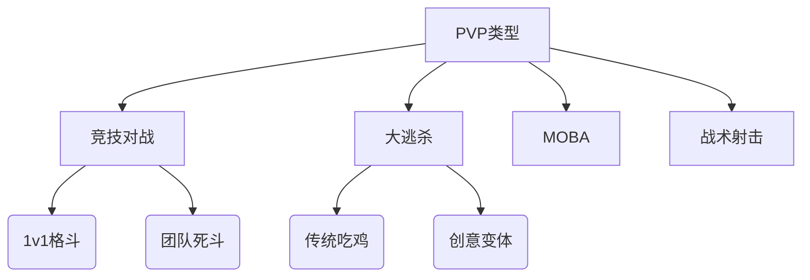
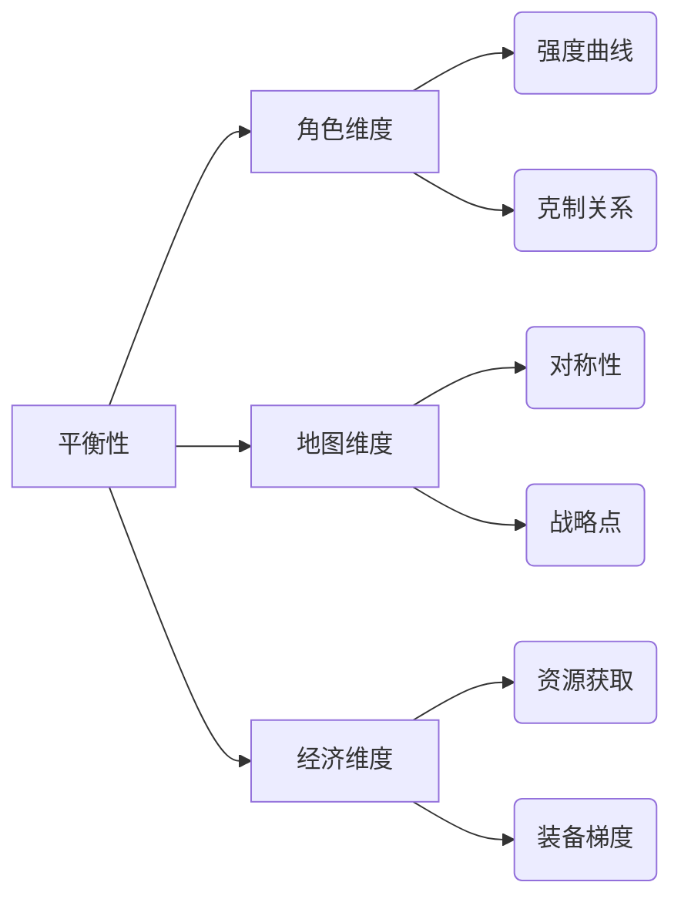

# 游戏战斗系统分析

## 1. 战斗系统的共性特征

### 1.1 资源管理机制

几乎所有战斗系统都包含某种形式的资源管理，这些资源构成了战斗策略的基础框架：

#### 健康资源
- **生命值(HP)**：最基础的健康指标，归零即战败
  - 变体：护盾值（优先消耗）、护甲值（减伤）、分段生命条（如《空洞骑士》的护符系统）
- **体力(Stamina)**：限制连续行动的耐力系统
  - 《黑暗之魂》的绿条机制：攻击、闪避、格挡共享消耗
  - 《怪物猎人》的耐力系统：影响移动和特殊动作
- **耐久度**：装备损耗机制
  - 《塞尔达传说》的武器耐久系统
  - 《暗黑破坏神》的装备耐久维修机制

#### 能量资源
- **魔法值(MP)**：传统法术施放资源
  - 《最终幻想》系列的经典MP系统
- **怒气值(Rage)**：通过受伤/攻击积累
  - 《魔兽世界》战士的怒气机制
  - 《DOTA2》英雄哈斯卡的血量转换系统
- **特殊能量**：角色专属资源
  - 《英雄联盟》劫的影能量
  - 《守望先锋》D.Va的机甲充能

#### 时间资源
- **冷却时间(CD)**：技能间隔限制
  - 固定CD（MOBA类游戏）
  - 动态CD（受属性影响）
- **行动点数(AP)**：回合制中的时间货币
  - 《XCOM》的双行动点系统
  - 《神界原罪》的AP自由分配机制
- **全局时间**：实时战略中的多线操作压力

#### 其他消耗资源
- **弹药系统**：射击游戏核心资源
  - 《生化危机》的稀缺弹药设计
  - 《无主之地》的弹药类型分化
- **召唤物限制**：如《炉石传说》的法力水晶
- **环境互动资源**：
  - 《博德之门3》的可交互场景元素
  - 《塞尔达传说》的化学引擎系统

### 1.2 输入-反馈循环（以《博德之门3》为例）

完整循环分解：
1. **输入阶段**：
   - 指令选择：左键点击目标/右键菜单选择技能
   - 快捷键：数字键1-6快速施法
   - 环境互动：按住Alt键高亮可交互物品

2. **处理阶段**：
   - 骰子检定：后台进行的D20成功率判定
   - 属性计算：力量/敏捷等属性影响结果
   - 环境因素：高地优势/火焰地表等影响

3. **反馈阶段**：
   - 视觉反馈：
     * 命中：红色伤害数字弹出+受击动画
     * 未命中："Miss"文字提示+闪避动作
     * 暴击：金色数字+特效放大
   - 听觉反馈：
     * 金属碰撞声（近战命中）
     * 法术咏唱音效（法术释放）
     * 角色语音（"我需要治疗！"）
   - UI反馈：
     * 行动点消耗显示
     * 状态图标变化
     * 战斗日志文字记录

4. **策略调整**：
   - 根据反馈调整站位
   - 重新评估资源分配
   - 改变技能释放顺序

其他优秀案例：
- 《哈迪斯》：手柄震动+屏幕抖动+音效的复合反馈
- 《只狼》：完美格挡的火花特效+独特音效
- 《魔兽世界》：技能亮边提示+浮动战斗文字

### 1.3 风险与奖励平衡

#### 攻击维度
| 攻击类型 | 风险等级 | 奖励程度 | 典型案例 |
|---------|---------|---------|---------|
| 普通攻击 | 低 | 低 | 《英雄联盟》基础攻击 |
| 蓄力攻击 | 高 | 高 | 《怪物猎人》大剑三段蓄力 |
| 背刺 | 中 | 高 | 《黑暗之魂》背刺机制 |
| 空中攻击 | 高 | 中 | 《鬼泣》空中连段 |
| 自伤技能 | 极高 | 极高 | 《DOTA2》哈斯卡牺牲 |

#### 防御维度
防御策略平衡三角：
```
        反击机会
          ▲
          │
资源消耗←─┼─→安全程度
```

典型案例：
- 《只狼》格挡：
  - 完美格挡：零资源消耗+创造反击机会
  - 普通格挡：消耗架势条+可能破防
- 《黑暗之魂》翻滚：
  - 无敌帧有限
  - 体力消耗制约连续翻滚
- 《魔兽世界》坦克机制：
  - 主动减伤技能CD管理
  - 仇恨值动态平衡

#### 资源循环模型
理想状态应形成动态平衡：
```
攻击消耗 → 获得优势 → 敌人施压 → 防御消耗 → 恢复机会 → 再次攻击
```
破坏平衡的常见问题：
- 资源恢复过快→战斗失去紧张感（如《暗黑3》早期版本）
- 消耗链条断裂→策略单一化（如《魔兽世界》某些版本的"木桩战"）

#### 现代解决方案
1. **动态难度调节**：
   - 《生化危机4》的隐藏弹药掉落机制
   - 《Hades》的祝福组合系统

2. **风险补偿机制**：
   - 《英雄联盟》击杀赏金系统
   - 《DOTA2》买活惩罚机制

3. **选择权重系统**：
   - 《杀戮尖塔》的牌组构建风险回报
   - 《怪物猎人》的不同武器风险梯度

## 2. 不同类型游戏的战斗系统特点

### 2.1 动作游戏（如《鬼泣》《黑暗之魂》）
- 强调实时反应和精确操作
- 包含复杂的连招系统和闪避机制
- 物理碰撞和命中判定非常精确
- 通常包含"帧数"概念，某些动作有无敌帧

### 2.2 角色扮演游戏（如《博德之门系列》《巫师》）
- 更注重数值成长和技能搭配
- 可能采用回合制或实时带暂停的战斗方式
- 包含丰富的状态效果（中毒、眩晕等）
- 装备和属性对战斗影响显著

### 2.3 策略游戏（如《火焰纹章》《XCOM》）
- 强调战术布局和单位配合
- 通常采用网格或六边形移动系统
- 包含命中率、暴击率等概率元素
- 地形和站位对战斗结果影响很大

### 2.4 射击游戏（如《使命召唤》《守望先锋》）
- 基于准星瞄准和弹道计算
- 包含弹药管理和换弹机制
- 掩体系统和视线判断很重要
- 可能有爆头等部位伤害机制

## 3. 现代战斗系统的创新趋势

1. **混合系统**：越来越多的游戏融合不同类型战斗系统的特点，如《原神》结合了动作游戏的实时战斗和RPG的角色培养。

2. **环境互动**：战斗不再局限于角色间的直接对抗，环境破坏、物理引擎等元素被更多整合进战斗系统。

3. **AI进化**：敌人AI更加智能，能够学习玩家行为模式并做出相应调整。

4. **网络协同**：多人合作战斗系统变得更加复杂和精细，如《怪物猎人》中的团队配合机制。

5. **无障碍设计**：更多游戏加入辅助功能，如自动瞄准、简化操作等，让不同水平的玩家都能享受战斗乐趣。

## 4. 战斗反馈机制

### 4.1 攻击行为的结果反馈（视觉/听觉/触觉多维度呈现）

**必现性原则**：所有攻击行为必须产生可感知的反馈，包括：
- **命中反馈**：
  - *视觉*：伤害数字（《暗黑破坏神》的浮动数字）、受击特效（《怪物猎人》的飙血效果）、屏幕震动（《DOOM》的暴力反馈）
  - *听觉*：命中音效（金属碰撞声/肉体打击声）、敌人受击语音（《守望先锋》的角色受伤台词）
  - *触觉*：手柄震动（《战神》的斧头命中回馈）、HD震动（NS版《哈迪斯》）

- **未命中反馈**：
  - 明确提示（《英雄联盟》的"Miss"提示）
  - 动作表现（《只狼》的武器擦火花特效）
  - 音效区分（《CS:GO》子弹擦过声）

- **特殊状态反馈**：
  - 暴击：放大特效（《原神》的星芒特效）+ 特殊音效
  - 格挡：火花特效（《黑暗之魂》盾反效果）
  - 免疫：特殊图标（《魔兽世界》的"免疫"漂浮文字）

**进阶设计技巧**：
- 渐强反馈（连续命中增强特效）
- 环境反馈（《塞尔达传说》的物理引擎互动）
- 个性化反馈（不同武器类型差异化的打击感）

### 4.2 战斗收益系统（构建可持续的正向循环）

**经验体系**：
- 基础经验值（根据敌人强度动态调整）
- 连击加成（《鬼泣》风格评分系统）
- 越级挑战奖励（《艾尔登法环》高等级敌人额外经验）

**战利品系统**：
| 掉落类型 | 设计要点 | 典型案例 |
|---------|---------|---------|
| 固定掉落 | 保底机制 | 《暗黑3》首领必掉传奇 |
| 随机掉落 | 惊喜感营造 | 《魔兽世界》世界掉落 |
| 条件掉落 | 增加深度 | 《怪物猎人》部位破坏奖励 |
| 赛季限定 | 维持新鲜度 | 《命运2》赛季武器 |

**成就系统设计**：
- 难度分级（铜/银/金成就）
- 隐藏成就（《血源诅咒》隐藏Boss成就）
- 进度追踪（《星际争霸2》成就进度条）

**剧情解锁**：
- 分支选择（《巫师3》战斗结果影响剧情）
- 隐藏结局（《尼尔：机械纪元》多周目战斗解锁）
- 角色关系（《火焰纹章》支援对话解锁）

**熟练度系统**：
- 武器专精（《骑马与砍杀》熟练度成长）
- 技能进化（《刺客信条》技能树解锁）
- 风格评级（《鬼泣》战斗风格养成）

**声望系统**：
- 阵营倾向（《辐射》系列阵营声望）
- 动态世界（《荒野大镖客2》荣誉系统）
- 特殊奖励（《魔兽世界》声望坐骑）

**创新收益机制**：
- 记忆传承（《死亡细胞》永久解锁机制）
- 肉鸽元素（《哈迪斯》黑暗宝石系统）
- 玩家经济（《EVE》太空战利品回收）

**反馈整合案例**：
《怪物猎人：世界》的完整战斗循环：
1. 攻击命中→ 飙血特效+手柄震动
2. 部位破坏→ 特写镜头+材料掉落
3. 讨伐成功→ 结算动画+技能经验
4. 装备锻造→ 战力提升→ 挑战更强怪物

优秀反馈机制应像精心调校的乐器，每个音符（反馈元素）都在正确的时间响起，共同演奏出让玩家沉浸的战斗交响曲。现代3A游戏通常采用"反馈层级"设计：
- 基础层：命中判定反馈（必须100%明确）
- 中间层：战斗收益反馈（需有可视化进度）
- 顶层：情感反馈（胜利pose/剧情演出）

## 5. PVE和PVP的策略设计

### 5.1 核心概念与演进趋势

**PVE（Player vs Environment）的现代演变**：
- 从静态AI到动态生态系统（《荒野大镖客2》的动物行为树）
- 叙事驱动战斗（《最后生还者2》的情感化战斗设计）
- 开放世界遭遇（《艾尔登法环》的无缝Boss战）
- 合作PVE的兴起（《命运2》的突袭副本设计）

**PVP（Player vs Player）的类型细分**：


### 5.2 乐趣生成机制对比分析

#### PVE的深层乐趣结构
**心理满足模型**：
1. 准备阶段：资源调配/装备选择（《怪物猎人》的狩猎前准备）
2. 执行阶段：模式识别（《只狼》的Boss出招规律）
3. 完成阶段：多巴胺释放（《黑暗之魂》的胜利反馈）

**创新设计案例**：
- 动态难度调整（《生化危机4》的隐形难度系统）
- 环境叙事战斗（《耻辱》的非致命通关设计）
- 物理引擎战斗（《塞尔达传说》的化学引擎）

#### PVP的竞技心理学
**心流状态创造**：
- 清晰目标（《CS:GO》的炸弹攻防）
- 即时反馈（《街霸6》的Drive系统）
- 技能匹配（《英雄联盟》的MMR算法）

**进阶乐趣点**：
- 元游戏发展（《Apex英雄》的赛季性meta变化）
- 社区文化（《DOTA2》的梗文化形成）
- 职业化观赏（《守望先锋》联赛的OB系统）

### 5.3 设计原则与最佳实践

#### PVE设计矩阵
| 要素 | 传统设计 | 现代进化 | 风险警示 |
|------|----------|----------|----------|
| AI行为 | 固定模式 | 机器学习适配 | 避免不可读性 |
| 难度曲线 | 线性成长 | 动态调整 | 防止挫败感 |
| 奖励机制 | 固定掉落 | 程序化生成 | 保持稀缺性 |

**Boss设计黄金法则**：
1. 三阶段原则（形态/模式变化）
2. 弱点可视化（《旺达与巨像》的毛发发光）
3. 逃生机制（《魔兽世界》的必杀技能预警）

#### PVP平衡框架


**反作弊技术栈**：
- 客户端检测（行为分析）
- 服务器验证（数据合理性校验）
- 机器学习（异常模式识别）

### 5.4 融合创新与未来趋势

**PVPvE混合模式**：
- 《逃离塔科夫》的生存撤离玩法
- 《黑暗降临》的开放世界冲突
- 《猎杀：对决》的赏金争夺机制

**AI增强设计**：
- 智能OB系统（自动捕捉精彩瞬间）
- 动态平衡AI（根据玩家表现调整）
- 语音交互敌人（《彩虹六号》的AI语音反应）

**社交化战斗**：
- 直播互动玩法（《Twitch Plays》模式）
- 玩家创作内容（《Roblox》的战斗游戏制作）
- 跨平台竞技（手机/PC/主机同场竞技）

### 5.5 失败案例分析

**PVE设计教训**：
- 《圣歌》的重复副本问题
- 《暗黑3》初版的难度墙
- 《辐射76》的AI空洞化

**PVP设计警示**：
- 《为战而生》的复杂系统混乱
- 《Artifact》的经济系统失衡
- 《巴比伦陨落》的匹配机制缺陷

当代游戏设计更倾向于搭建"游乐场"而非"轨道"，如《艾尔登法环》既保留精心设计的Boss战，又通过入侵系统引入PVP元素，创造出动态的战斗体验生态系统。未来战斗系统将更加注重：
1. 模糊PVE/PVP界限
2. AI驱动的个性化体验
3. 跨媒介战斗交互
4. 玩家生成内容整合

## 6. 战斗模式分析

### 6.1 即时战斗系统（Real-Time Combat）

**特点**：
- 时间连续流动
- 需要快速反应和实时操作
- 强调动作技巧和时机把握

**子类型**：
1. **纯动作型**（如《鬼泣》）
   - 高度依赖玩家操作技巧
   - 复杂的连招系统
   - 精确的命中判定

2. **策略即时型**（如《星际争霸》）
   - 兼顾宏观策略和微观操作
   - 多单位控制
   - 资源管理和战术执行

3. **混合型**（如《魔兽世界》）
   - 结合技能冷却和资源管理
   - 既有实时操作也有策略规划
   - 团队配合至关重要

**设计挑战**：
- 平衡动作技巧和策略深度
- 处理网络同步问题（对于多人游戏）
- 控制战斗节奏避免过度疲劳

### 6.2 回合制战斗系统（Turn-Based Combat）

**特点**：
- 时间分割为离散的回合
- 玩家有充分时间思考策略
- 更注重规划和资源管理

**子类型**：
1. **传统回合制**（如《最终幻想》早期作品）
   - 严格的轮流行动顺序
   - 基于菜单选择的指令输入
   - 明确的回合阶段划分

2. **策略回合制**（如《火焰纹章》）
   - 结合网格移动系统
   - 单位定位和地形利用
   - 永久死亡等高风险机制

3. **半即时制**（如《欧陆风云4》的实时带暂停）
   - 时间连续流动但可暂停
   - 暂停时规划指令
   - 结合了实时和回合制的特点

**设计挑战**：
- 保持回合间的连贯性和节奏感
- 避免"最优解"导致的玩法单一化
- 平衡随机元素和策略深度

### 6.3 其他创新战斗模式

1. **时间操控系统**（如《超级马力欧银河》的慢动作区域）
   - 允许玩家操控时间流速
   - 创造独特的解谜和战斗机会

2. **节奏战斗系统**（如《节奏地牢》）
   - 战斗动作与音乐节奏同步
   - 将音乐元素融入核心玩法

3. **物理模拟战斗**（如《人类一败涂地》）
   - 基于物理引擎的滑稽战斗
   - 不可预测的结果带来欢乐体验

4. **自动战斗系统**（如《刀塔传奇》）
   - 角色自动战斗，玩家策略集中于战前准备
   - 降低操作门槛，强调阵容搭配

5. **异步对战系统**（如《皇室战争》的录像回放对战）
   - 玩家不与真人实时对抗
   - 与AI模拟的其他玩家阵容对战

### 6.4 选择战斗模式的考量因素

1. **游戏主题**：战斗模式应与游戏整体风格一致
2. **目标受众**：休闲玩家可能更适合简单直观的系统
3. **技术限制**：某些模式对引擎或网络有特殊要求
4. **创新需求**：独特战斗系统可以成为游戏卖点
5. **叙事需求**：故事驱动型游戏可能偏好节奏可控的模式

### 6.5 未来发展趋势

1. **AI适应性战斗**：敌人根据玩家水平动态调整
2. **VR/AR战斗系统**：更沉浸式的物理交互
3. **神经控制输入**：潜在的思维控制战斗可能性
4. **跨模式融合**：模糊实时和回合制的传统界限
5. **个性化平衡**：根据玩家偏好自动调整游戏参数

## 7. 设计优秀战斗系统的关键

1. **清晰易懂**：玩家应该能够直观理解战斗规则和反馈
2. **深度与广度**：简单上手但难以精通，提供足够的探索空间
3. **节奏控制**：战斗应该有适当的紧张与放松交替
4. **公平性**：无论是PVE还是PVP，战斗系统都应感觉公平
5. **与游戏主题一致**：战斗风格应该符合游戏的整体氛围和叙事

