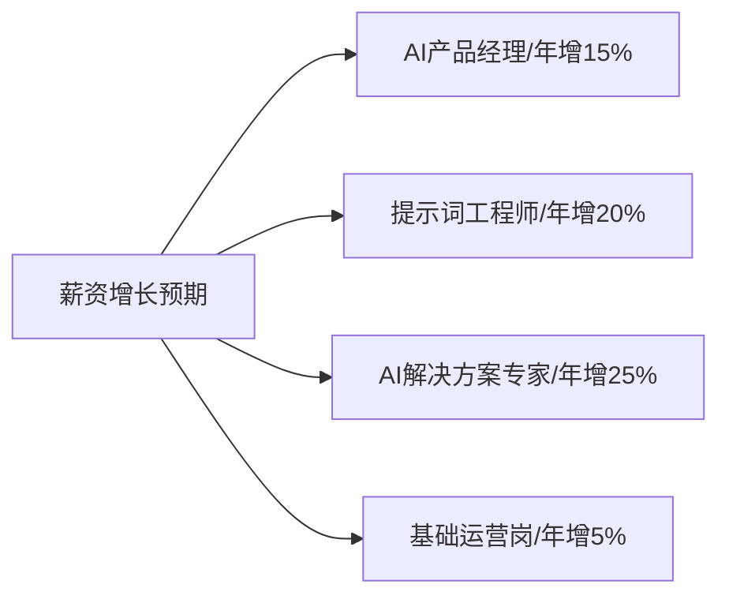

# 非技术岗在AI行业的就业全景分析

## 一、市场概况与职业分布

<div class="mermaid">
pie
    title 2024年AI行业非技术岗位分布
    "AI产品经理" : 28
    "AI运营/内容策划" : 24
    "商业分析/解决方案" : 19
    "AI伦理/合规官" : 12
    "行业专家顾问" : 10
    "数据标注管理" : 7
</div>

当前中国AI行业非技术岗就业呈现以下特点：

| 维度 | 市场现状 | 趋势预判 |
|------|---------|---------|
| 招聘需求 | 过去6个月增长32% | 未来1年预计增长35-40% |
| 薪资水平 | 较传统产品运营高20-30% | 大模型专精岗位溢价50%+ |
| 人才缺口 | 约15万人 | 2025年预计缺口25万人 |
| 区域分布 | 北京、上海、深圳、杭州为主 | 成都、西安等新一线城市需求上升 |

---

## 二、热门非技术岗位详解

### 1. **AI产品经理**

**市场定位**：大模型应用"翻译官"，连接技术与业务

**核心职责**：
- 设计模型能力与行业场景结合的应用方案
- 协调开发、测试与用户反馈闭环
- 主导产品迭代策略，设计评估方法

**典型案例**：某快消企业数字员工平台产品经理
```markdown
工作内容:
- 设计智能客服交互流程，将AIGC能力融入CRM系统
- 优化问答知识库，提升应答准确率从78%到92%
- 建立多轮对话测评体系，每周产出优化方案
```

**薪资区间**：25万-60万（初级），60万-120万（资深）

**入职门槛**：
- 本科及以上学历，计算机/商科背景优先
- 1-3年产品经理经验
- 熟悉基本AI概念（不需精通算法）

---

### 2. **AI内容运营**

**市场现状**：需求暴涨，特别是短视频平台和内容生产商

**核心任务**：
- 提示词库建设与管理
- 内容质检与风险控制
- 调研用户使用习惯，优化AI生成内容

**岗位细分**：
<div class="mermaid">
graph LR
    A[AI内容运营] --> B[AIGC内容策划]
    A --> C[提示词工程师]
    A --> D[数字人运营]
    A --> E[AI创意总监]
</div>

**求职案例**：某旅游平台提示词运营
```
工作内容：
1. 开发旅行攻略生成提示词模板
2. 优化目的地介绍的多样性表达
3. 建立AI生成内容审核标准
```

**薪资区间**：18万-40万（初级），40万-80万（资深）

---

### 3. **垂直行业解决方案专家**

**需求趋势**：最急缺人才，溢价最高

**行业分布**：
| 行业 | 需求程度 | 典型职位 | 薪资范围 |
|------|---------|---------|---------|
| 医疗 | ★★★★★ | AI医疗顾问 | 50-150万 |
| 金融 | ★★★★☆ | 智能风控专家 | 45-120万 |
| 教育 | ★★★☆☆ | AI课程设计师 | 35-90万 |
| 制造 | ★★★★☆ | 工业AI咨询 | 40-100万 |

**能力要求**：
- 8年+行业经验
- 深入理解行业痛点和业务流程
- 能够"翻译"行业需求为AI解决方案
- 具备项目管理能力

**典型职责**：
```
某医疗AI解决方案专家:
- 梳理临床诊断流程，设计AI辅助决策点
- 协助构建医疗知识图谱和术语库
- 制定医疗AI系统评估标准
- 培训医生有效使用AI工具
```

---

## 三、就业竞争力分析

### 1. **最受欢迎的跨界背景**

<div class="mermaid">
graph TD
    A[非技术人才竞争力] --> B[行业经验]
    A --> C[内容生产能力]
    A --> D[数据分析能力]
    A --> E[项目管理能力]
    A --> F[伦理法规了解]
</div>

### 2. **企业最看重的能力**

| 能力项 | 重要性 | 实践建议 |
|-------|------|---------|
| 业务转化能力 | ★★★★★ | 学会将AI能力转化为业务价值 |
| 用户体验设计 | ★★★★☆ | 了解人机交互与自然语言处理原理 |
| 结构化思维 | ★★★★☆ | 练习系统设计与流程优化 |
| 场景洞察力 | ★★★★★ | 持续关注行业痛点与AI应用实例 |
| AI伦理意识 | ★★★☆☆ | 学习隐私保护与公平性原则 |

### 3. **求职渠道效率对比**

| 渠道 | 效果评分 | 特点 |
|-----|---------|-----|
| AI专业招聘会 | ★★★★★ | 针对性强，大模型创业公司偏爱 |
| LinkedIn | ★★★★☆ | 外企和大厂岗位较多 |
| 脉脉/BOSS直聘 | ★★★★☆ | 中小企业和创业公司为主 |
| 校园招聘 | ★★☆☆☆ | 主要针对应届生和实习生 |
| 行业社群 | ★★★★★ | 高端岗位多通过推荐获得 |

---

## 四、入行与进阶指南

### 1. **入行路径建议**

**零基础转型路线**：
```
第一阶段(1-3个月):
- 完成1-2门AI基础课程(推荐吴恩达AI入门)
- 注册并深度使用3-5款主流AI应用
- 参与AI产品众测项目

第二阶段(4-6个月):
- 学习提示词工程基础
- 完成1个AI应用落地小项目
- 参与AI社区和行业研讨会

第三阶段(7-12个月):
- 针对性强化某个垂直行业知识
- 构建个人AI应用作品集
- 开始有针对性的求职
```

**已有行业经验的专业人士**：
```markdown
快速入行方案:
1. 梳理你的行业痛点清单
2. 研究AI解决方案可行性
3. 搭建概念验证Demo
4. 联系行业内AI创业公司
```

### 2. **能力提升资源**

**推荐课程**：
- 《AI产品经理实战营》(优达学城)
- 《大模型商业应用》(清华继续教育学院)
- 《提示词工程与AI内容创作》(得到)

**实用工具与社区**：
```python
resources = {
    "社区": ["AI产品经理大会", "AIGC内容创作者社区", "知乎-AI话题"],
    "工具": ["Notion AI", "ChatGPT", "Midjourney", "文心一言"],
    "竞赛": ["AI创新应用大赛", "全球AI挑战赛-商业赛道"]
}
```

### 3. **避坑指南**

⚠️ **求职陷阱预警**：
- 过度夸大AI能力的创业公司
- "全能型"岗位(一人承担产品+运营+销售)
- 缺乏数据基础的传统企业AI转型项目

🔔 **职业发展风险**：
- 过度依赖单一平台经验
- 缺乏技术理解导致沟通障碍
- 忽视行业专业性(如医疗AI需要医学知识)

---

## 五、2025年趋势预测

### 1. **新兴细分岗位**

| 岗位名称 | 岗位预测 | 核心能力要求 |
|---------|---------|------------|
| AI数字人设计师 | 需求爆发期 | 性格设计+语言学+表演 |
| 大模型体验评估师 | 稳步增长 | 用户研究+测试方法论 |
| AI伦理官 | 政策驱动增长 | 法律+伦理+AI技术理解 |
| 垂直行业AI培训师 | 高速增长 | 教学设计+行业经验 |

### 2. **薪资趋势预测**



### 3. **核心竞争力转变**

当前主流能力:
- 理解产品逻辑
- 基础提示词技巧
- 用户需求分析

2025年核心能力:
- AI系统架构设计能力
- 复杂Agent行为设计
- 行业知识库构建
- 多模态内容策划

---

## 六、实战建议

### 个人简历优化要点
1. **突出AI实践项目**（即使是个人项目）
2. **量化成果**（提升效率X%，降低成本Y%）
3. **展示行业洞察**（不只是技术应用）
4. **添加AI工具熟练度**（特别是提示词能力）

### 面试准备策略
```markdown
1. 准备3个详细的AI应用案例分析
2. 学会用非技术语言解释AI概念
3. 针对目标公司产品提出改进建议
4. 准备讨论AI伦理与隐私问题
```
