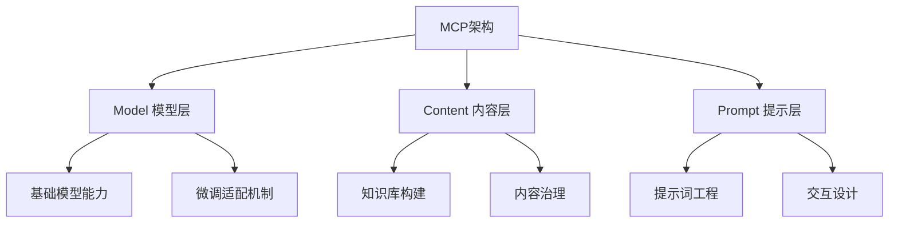
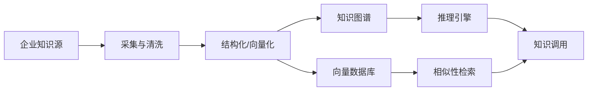
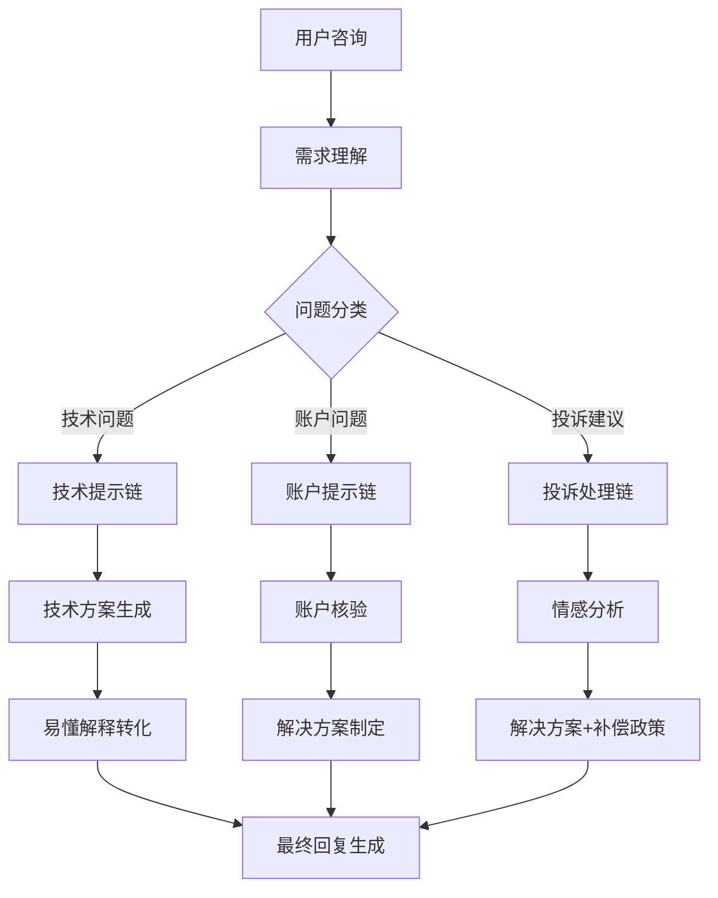
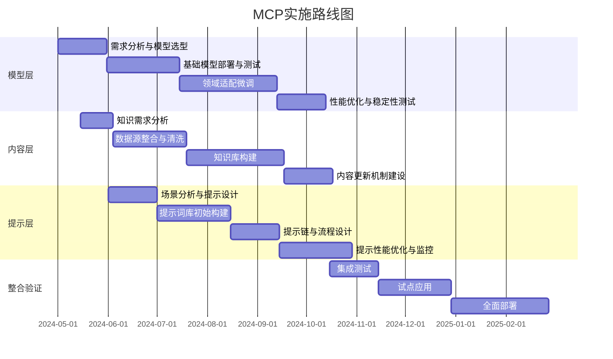
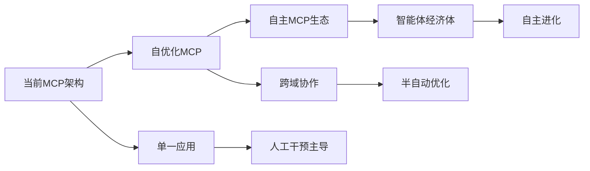
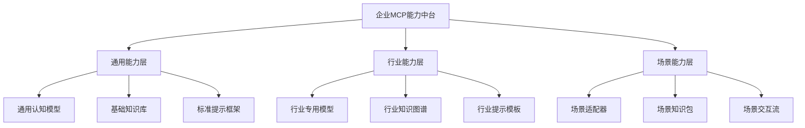

此MCP非彼MCP。

# 大模型商业化核心：MCP (Model, Content, Prompt) 架构详解

## 一、MCP架构全景概述



MCP架构是大模型商业化落地的核心框架，通过**模型能力、内容体系与提示工程**的有机结合，实现AI应用从实验室到生产环境的转化。

| 架构层级 | 核心价值 | 商业化挑战 |
|---------|---------|----------|
| Model层 | 奠定基础算力与认知能力 | 成本、延迟、幻觉 |
| Content层 | 确保专业性与正确性 | 时效性、版权、结构化 |
| Prompt层 | 优化交互与实用性 | 用户体验、一致性、效率 |

---

## 二、Model层详解：算力与能力的平衡艺术

### 1. 模型选型与部署策略

```markdown
【企业级模型选型决策树】

模型选择:
├── 自研路线 → 资金充足+有核心技术团队+对数据安全有极高要求
├── 国产大模型 → 需要合规+本地化部署+中文优势（文心一言/千问/月之暗面等）
├── 开源模型 → 成本敏感+需要深度定制（Llama-3/Qwen/Yi/Gemma）
└── 国际云API → 性能优先+快速验证（GPT-4/Claude-3）
```

**合规性考量**：
- 通用大模型：需取得《增值电信业务许可证》
- 垂直大模型：须完成信息服务备案
- 数据安全：《数据安全法》《个人信息保护法》合规审查

### 2. 模型能力矩阵

| 能力维度 | 评估指标 | 商业价值衡量 |
|---------|---------|------------|
| 基础理解 | MMLU/C-Eval分数 | 减少知识性错误率 |
| 推理能力 | GSM8K/BBH | 解决复杂业务问题 |
| 指令遵循 | MT-Bench/HELM | 提升任务完成率 |
| 多模态 | SEED/MME | 拓展业务应用场景 |
| 安全合规 | 防护评测/红线测试 | 降低合规风险 |

### 3. 模型增强技术

**RAG (检索增强生成)**：
```python
# 典型RAG架构示例
def enterprise_rag_system(query, company_docs):
    # 1. 企业文档向量化存储
    embeddings = get_embeddings(company_docs)
    vector_db.store(embeddings)
  
    # 2. 混合检索策略
    relevant_docs = hybrid_search(
        query,
        strategies=["vector", "keyword", "knowledge_graph"]
    )
  
    # 3. 上下文组装
    context = assemble_context(
        relevant_docs, 
        max_tokens=6000,
        recency_boost=True
    )
  
    # 4. 大模型回答生成
    response = llm.generate(
        prompt=f"基于以下公司信息回答问题:\n{context}\n问题:{query}",
        temperature=0.3
    )
  
    return response
```

**模型微调技术对比**：

| 技术方案 | 适用场景 | 成本 | 效果提升 |
|---------|---------|-----|---------|
| LoRA/QLoRA | 领域适配/行业术语 | 低 | 10-30% |
| SFT全参数微调 | 深度定制/品牌语气 | 高 | 30-70% |
| RLHF/DPO | 对齐企业价值观/偏好 | 中高 | 20-50% |
| 知识蒸馏 | 轻量化部署/边缘计算 | 中 | 模型体积↓95% |

---

## 三、Content层：知识基础设施建设

### 1. 企业知识库架构设计



**知识来源分层**：
- L1: 权威公开知识（行业标准/学术文献）
- L2: 企业专有知识（内部文档/流程手册）
- L3: 交互式知识（客户反馈/案例库）
- L4: 实时动态知识（市场变化/竞品动向）

### 2. 企业内容治理框架

**内容安全层级防护**：
```python
# 多层次内容安全防护伪代码
def content_safety_pipeline(user_input, response_draft):
    # 输入安全检查
    input_risks = input_filter(
        text=user_input,
        filters=["敏感词", "注入攻击", "越狱提示"]
    )
    if input_risks:
        return safe_rejection_response(input_risks)
  
    # 输出安全检查
    output_risks = output_filter(
        text=response_draft,
        policies=["合规性", "事实准确性", "品牌一致性"]
    )
    if output_risks:
        return remediated_response(response_draft, output_risks)
  
    # 后处理增强
    final_response = post_process(
        response_draft, 
        enhancements=["引用来源", "信心水平标注"]
    )
  
    return final_response
```

**内容时效性保障**：
| 知识类型 | 更新频率 | 同步策略 | 技术方案 |
|---------|---------|---------|---------|
| 产品信息 | 随发布更新 | 自动同步 | API集成 |
| 政策法规 | 定期扫描 | 半自动 | 爬虫+人工审核 |
| 市场动态 | 实时监控 | 自动+人工确认 | RSS+关键词监测 |
| 内部文档 | 版本控制 | 定时同步 | Git集成 |

### 3. 多模态内容增强

**场景化多模态应用**：
- **客户服务**：产品图示+操作视频+文字指引
- **培训系统**：概念图表+交互示例+语音解说
- **销售支持**：竞品对比可视化+个性化报价单生成
- **知识管理**：文档智能摘要+关系图谱可视化

---

## 四、Prompt层：交互设计与体验优化

### 1. 企业级提示词工程系统

**提示词模板库设计**：
```json
{
  "template_id": "financial_advisor_01",
  "version": "2.3",
  "purpose": "投资顾问咨询回复",
  "template_structure": {
    "system_prompt": "你是{{company_name}}的专业投资顾问，持有CFP认证。你需要根据客户风险偏好({{risk_profile}})提供投资建议。所有建议必须符合{{compliance_rules}}。",
    "few_shot_examples": [
      {"query": "...", "response": "..."},
      {"query": "...", "response": "..."}
    ],
    "response_format": {
      "greeting": "称呼客户为{{customer_name}}",
      "understanding": "首先复述客户需求，确保理解准确",
      "analysis": "提供市场分析，引用最新数据",
      "recommendation": "给出3-5个具体建议，每个包含理由和风险提示",
      "compliance": "添加免责声明：{{disclaimer_text}}",
      "next_steps": "提出1-2个后续行动建议"
    }
  },
  "metrics": {
    "avg_customer_satisfaction": 4.7,
    "compliance_pass_rate": 99.2%,
    "avg_response_time": "12s"
  }
}
```

### 2. 提示链工程(Prompt Chaining)

**复杂业务流程拆解**：


**跨部门协作流示例**：
```python
def sales_to_implementation_chain(client_requirements):
    # 1. 销售环节 - 需求收集与方案初拟
    sales_prompt = PromptTemplate(
        "基于以下客户需求，制定初步解决方案建议:\n{requirements}"
    )
    sales_proposal = llm_sales.generate(sales_prompt.format(requirements=client_requirements))
  
    # 2. 解决方案团队 - 技术可行性评估
    solution_prompt = PromptTemplate(
        "评估以下销售方案的技术可行性:\n{proposal}\n"
        "请提出具体实施计划与资源需求"
    )
    implementation_plan = llm_technical.generate(
        solution_prompt.format(proposal=sales_proposal)
    )
  
    # 3. 财务团队 - 成本预算评估
    finance_prompt = PromptTemplate(
        "基于以下实施计划，进行成本核算与ROI分析:\n{plan}"
    )
    financial_assessment = llm_finance.generate(
        finance_prompt.format(plan=implementation_plan)
    )
  
    # 4. 集成最终提案
    final_prompt = PromptTemplate(
        "整合以下各部门输入，生成最终客户提案:\n"
        "销售建议: {sales}\n技术方案: {tech}\n财务分析: {finance}"
    )
    final_proposal = llm_executive.generate(
        final_prompt.format(
            sales=sales_proposal,
            tech=implementation_plan,
            finance=financial_assessment
        )
    )
  
    return final_proposal
```

### 3. 提示词性能优化技术

**A/B测试框架**：
- 并行评估多个提示策略
- 关键指标：任务成功率、用户满意度、执行效率
- 自动化筛选最优提示方案

**提示词版本管理**：
```python
# 提示词版本管理系统
class PromptVersionControl:
    def deploy_prompt(self, prompt_id, prompt_text, department):
        """部署新版提示词"""
        version = self.create_new_version(prompt_id, prompt_text)
        self.log_deployment(version, department)
        return version
      
    def rollback(self, prompt_id, target_version):
        """回滚到指定版本"""
        self.set_active_version(prompt_id, target_version)
      
    def performance_tracking(self, prompt_id, version, metrics):
        """记录性能指标"""
        self.update_metrics(prompt_id, version, metrics)
      
    def generate_performance_report(self, prompt_id):
        """生成性能报告"""
        versions = self.get_all_versions(prompt_id)
        return self.analyze_performance_trend(versions)
```

---

## 五、MCP整合：垂直行业应用案例

### 1. 金融行业MCP方案

| 架构层 | 实施方案 | 关键价值 |
|-------|---------|---------|
| Model | 合规特化微调+最新监管数据定期同步 | 降低合规风险 |
| Content | 投资产品知识库+市场分析数据+客户画像 | 个性化金融服务 |
| Prompt | 风险评估模板+投资建议生成链+合规审查流程 | 顾问服务标准化 |

**应用场景**：智能投顾系统
- 模型确保财务建议专业性
- 内容保证市场数据实时性
- 提示词引导出合规且个性化的投资方案

### 2. 医疗行业MCP方案

| 架构层 | 实施方案 | 关键价值 |
|-------|---------|---------|
| Model | 医学知识微调+隐私防护增强 | 专业可信赖 |
| Content | 医学文献库+临床指南+病历结构化数据(脱敏) | 循证医学支持 |
| Prompt | 症状分析链+诊断推理模板+治疗方案生成器 | 辅助临床决策 |

**应用场景**：医疗助手系统
- 模型识别专业术语并避免过度诊断
- 内容提供最新治疗方案与药物信息
- 提示词引导结构化病情分析与建议

---

## 六、MCP实施路线图（续）

### 1. 企业实施阶段



### 2. 资源投入规划

**人才配置矩阵**：

| 角色 | 职责 | 配置建议 | 核心能力要求 |
|-----|-----|---------|------------|
| MCP架构师 | 整体架构设计与协调 | 1名(全职) | 技术+业务+管理 |
| 模型工程师 | 模型部署与优化 | 2-3名 | MLOps+分布式系统 |
| 知识工程师 | 内容体系建设 | 2-4名 | 知识图谱+数据处理 |
| 提示工程师 | 交互设计与优化 | 2-3名 | UX+自然语言理解 |
| 领域专家 | 业务知识提供 | 按需兼职 | 垂直行业经验 |
| 质量评估师 | 综合测试与评估 | 1-2名 | 测试方法+数据分析 |

**投资回报测算**：

| 投入项目 | 成本占比 | 回报周期 | ROI指标 |
|---------|---------|---------|---------|
| 基础设施（硬件/云资源） | 25-35% | 12-24个月 | TCO降低20-30% |
| 人力资源 | 40-50% | 6-18个月 | 人效提升30-50% |
| 数据资源 | 15-20% | 9-15个月 | 决策准确率提升15-25% |
| 外部服务 | 5-10% | 3-9个月 | 上线周期缩短40-60% |

### 3. MCP成熟度评估模型

**五级成熟度框架**：

| 级别 | 特征 | 关键指标 | 代表企业特征 |
|-----|-----|---------|-------------|
| L1: 实验性 | 单点应用、无体系 | 原型验证 | 创新探索型企业 |
| L2: 基础性 | 基本MCP元素就位 | 基础功能可用 | 数字化转型中企业 |
| L3: 规范化 | 标准流程、可复用组件 | 规模初步显现 | 中大型科技企业 |
| L4: 优化化 | 持续优化、数据驱动 | 明显ROI | 行业引领者 |
| L5: 转型性 | AI驱动业务创新 | 新业务模式 | 数字原生企业 |

**企业自评检查表**：
```markdown
- 模型层成熟度
  - [ ] 是否有明确的模型选型标准?
  - [ ] 是否建立了模型性能评估体系?
  - [ ] 是否实现模型迭代升级机制?
  - [ ] 是否具备故障转移与灾备方案?

- 内容层成熟度
  - [ ] 是否完成核心知识库构建?
  - [ ] 是否有内容的时效性管理机制?
  - [ ] 是否实现知识的结构化与关联?
  - [ ] 是否建立内容质量评估标准?

- 提示层成熟度
  - [ ] 是否建立提示词模板库?
  - [ ] 是否实现提示链工程?
  - [ ] 是否有提示性能监测机制?
  - [ ] 是否支持个性化提示优化?
```

---

## 七、MCP架构商业案例分析

### 1. 保险行业MCP成功案例

**背景**: 某大型保险集团实施MCP架构，构建智能理赔与咨询系统

**模型层实施**:
- 基础模型: 定制微调文心一言(国内合规要求)
- 安全增强: 客户数据隐私保护机制
- 部署方式: 混合云架构(敏感数据本地处理)

**内容层构建**:
```python
# 保险知识库结构设计
insurance_knowledge_graph = {
    "产品目录": {
        "车险": ["交强险", "商业险", "附加险"],
        "人寿险": ["定期寿险", "终身寿险", "重疾险"],
        "财产险": ["家财险", "企财险"]
    },
    "理赔流程": {
        "报案": ["线上报案", "电话报案", "柜面报案"],
        "定损": ["远程定损", "现场定损"],
        "核赔": ["材料审核", "调查核实"],
        "赔付": ["线上赔付", "线下赔付"]
    },
    "法规政策": {
        "监管规定": ["银保监会规定", "地方监管细则"],
        "司法解释": ["最高院解释", "典型案例"]
    }
}
```

**提示层设计**:
- 场景化模板: 针对不同保险咨询场景的30+专用提示模板
- 理赔顾问提示链: 报案指引→案件分析→补充资料建议→赔付预估
- 智能核保提示链: 风险评估→条款解读→定价建议→替代方案

**成果指标**:
- 理赔处理效率: 提升67%
- 客户等待时间: 减少54%
- 理赔准确率: 提升23%
- 客户满意度: 提升31%
- 系统负载: 高峰期减少42%

### 2. 制造业MCP应用案例

**背景**: 某高端装备制造企业实施MCP架构的设备诊断与维护系统

**模型层选择**:
- 基础技术栈: Llama-3-70B本地部署 + 专有数据微调
- 多模态增强: 设备图像识别模型集成
- 性能优化: 量化加速(INT4)实现边缘设备推理

**内容层建设**:
- 设备全生命周期数据库: 从设计规格到维修记录
- 故障案例库: 10万+真实故障案例结构化存储
- 专家经验库: 退休工程师经验数字化保存(100+人年经验)
- 实时传感器数据集成: IoT平台对接

**提示层实现**:
```markdown
【设备故障诊断提示链】

1. 初步分析提示:
"分析以下设备警报和参数数据，识别可能的故障类型:
设备ID: {device_id}
警报代码: {alert_codes}
参数读数: {sensor_readings}"

2. 深度诊断提示:
"基于初步分析结果{initial_diagnosis}和历史故障模式，
提供详细故障分析和可能原因排序。
参考类似案例ID: {similar_case_ids}"

3. 维修方案提示:
"为确诊的{failure_type}故障，生成维修方案:
1. 所需备件清单
2. 维修步骤(附技术图示引用)
3. 安全注意事项
4. 预计维修时间和人力需求"

4. 预防建议提示:
"基于此次故障{failure_details}，提供预防类似问题的建议:
1. 维护周期调整
2. 监测参数优化
3. 操作规程改进"
```

**成果指标**:
- 设备停机时间: 减少46%
- 维修成本: 降低32%
- 故障预测准确率: 78%(传统方法为43%)
- 新员工培训时间: 缩短65%
- ROI: 18个月内实现投资回报

---

## 八、MCP架构未来发展趋势

### 1. 技术演进方向



**关键技术突破点**:
- **自优化模型层**: 持续学习机制、动态架构调整
- **自组织内容层**: 知识自动发现与整合、信息价值评估
- **自生成提示层**: 提示模板自动生成与优化、上下文自适应

### 2. 企业应用展望

**商业模式创新**:
- MCP即服务(MCPaaS)平台
- 垂直行业MCP解决方案市场
- AI原生企业与传统企业协作新模式

**跨界应用趋势**:
| 融合领域 | 创新应用 | 价值创造 |
|---------|---------|---------|
| MCP+IoT | 智能工厂全流程优化 | 生产效率提升30%+ |
| MCP+区块链 | 可信AI决策与审计 | 合规成本降低40%+ |
| MCP+元宇宙 | 沉浸式知识交互 | 培训效果提升50%+ |
| MCP+生物技术 | 精准医疗决策支持 | 诊断准确度提升25%+ |

### 3. MCP生态系统展望

**生态角色与价值网络**:
- 基础模型提供商: 算力与基础能力
- 垂直领域内容专家: 专业知识与数据
- 提示工程服务商: 交互设计与优化
- 集成解决方案商: 端到端实施与服务
- 行业标准组织: 互操作标准与评估体系

**开放协作趋势**:
- 行业MCP标准与协议
- 模块化组件与开源生态
- 知识共享联盟与数据协作
- 跨企业智能体协作网络

---

## 九、MCP架构实施关键成功因素

### 1. 战略层面

**高管支持与愿景**:
- 明确AI转型战略目标
- 资源承诺与长期投入
- 组织文化适应性建设

**核心指标设计**:
```python
# MCP战略评估指标体系
strategic_kpis = {
    "业务影响": [
        "收入增长贡献率",
        "成本节约百分比",
        "客户满意度变化",
        "决策效率提升"
    ],
    "创新能力": [
        "新产品/服务上市速度",
        "AI驱动业务模式数量",
        "跨部门协作效率"
    ],
    "风险控制": [
        "合规事件减少率",
        "安全漏洞响应时间",
        "质量异常降低比例"
    ]
}
```

### 2. 执行层面

**跨职能协作机制**:
- AI卓越中心(CoE)建设
- 业务与技术深度融合
- 敏捷项目管理适配

**人才培养与文化**:
- MCP技能矩阵构建
- AI素养全员培训计划
- 知识共享与创新激励

### 3. 常见陷阱与规避策略

| 实施陷阱 | 表现症状 | 规避策略 |
|---------|---------|---------|
| 技术驱动而非业务驱动 | 炫技但解决不了实际问题 | 始于业务痛点，以价值为导向 |
| 忽视变革管理 | 技术就位但员工抵触 | 全程利益相关方参与，提前培训 |
| 过度复杂化 | 周期延长，成本超支 | MVP策略，小步快跑 |
| 数据孤岛与质量问题 | 内容层效果不佳 | 数据治理先行，质量优于数量 |
| 忽视持续优化 | 上线后性能逐步下滑 | 构建监控与反馈闭环系统 |

---

## 十、MCP赋能企业战略转型（续）

### 1. 从工具到能力中台

**MCP能力中台架构**:


### 2. MCP驱动的数字化转型路径

| 转型阶段 | MCP关键作用 | 组织变革重点 |
|---------|----------|------------|
| 智能感知 | 数据分析与洞察 | 数据驱动决策文化 |
| 流程再造 | 智能工作流与自动化 | 核心流程优化与重构 |
| 业务创新 | 新产品与服务赋能 | 创新激励与快速验证 |
| 模式重塑 | 商业模式转型支持 | 组织架构与职能调整 |

### 3. 竞争优势构建

**可持续竞争壁垒**:
- 专有数据资产及其结构化价值
- 独特业务流程的AI增强能力
- 企业特有知识与智能的融合

---

## 总结：MCP架构实施五大关键点

1. **战略定位**：将MCP架构作为企业AI能力底座，而非孤立项目

2. **平衡投入**：三层架构协同发展，避免"重模型轻内容提示"偏差

3. **迭代进化**：采用MVP策略，从核心场景切入，循序渐进拓展

4. **人机协同**：以人为中心设计MCP架构，实现人机优势互补

5. **价值衡量**：建立多维度评估体系，确保业务价值持续实现

---

## 行动建议

### 企业决策者

1. 启动MCP架构评估，确定当前成熟度水平
2. 制定分阶段MCP实施路线图，明确关键里程碑
3. 组建跨部门MCP核心团队，分配职责与资源

### 技术负责人

1. 建立模型-内容-提示协同开发方法论
2. 设计技术架构与数据流，确保安全与效率
3. 构建监控与评估体系，支持持续优化

### 业务部门

1. 识别并优先排序MCP应用场景
2. 参与内容资源建设与领域知识沉淀
3. 建立实施效果评估与反馈机制
